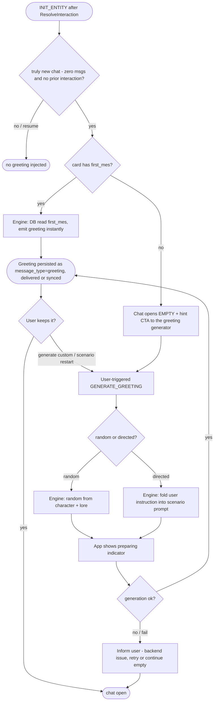

# Character Data & Chat-Start Engine — Data/Backend Concept

> **Scope owner:** Data & backend architect (this doc).
> **Out of scope:** UX/visualization of the data (owned by the frontend/UX architect). This doc notes *data implications* for UX only.
> **Mode:** Brainstorming/planning — options + trade-offs + a **recommended** path. No implementation code.

---

## 0. Executive summary (headline recommendations)

| Decision | Recommendation |
|---|---|
| **Greeting field (`first_mes`)** | New **column** on `character_profiles`. Stop burying it in `example_dialogues`. |
| **`mes_example`, `post_history_instructions`, `creator_notes`, `creator`, `character_version`, `nickname`** | New **columns** (single strings, queryable/displayed/round-trippable). |
| **`alternate_greetings`, `tags`, `group_only_greetings`** | **JSON-in-column** (small arrays, never individually queried, perfect round-trip). |
| **`extensions`, `assets`, card provenance** | Opaque **JSON columns** (`extensions`, `assets`, `card_provenance`) to guarantee spec-mandated round-trip. |
| **Lorebook** | **RAG semantic ingestion.** Store the whole `character_book` (top-level + entries) as a single **JSON column** on `character_profiles`; embed each entry's `content` into a per-entity `chromem-go` RAG collection (on import/edit **and at `INIT_ENTITY`**); at prompt-build run a **semantic query** over recent conversation context and inject the top-N entries. Reuses the existing RAG module ([`vector_store.go`](../harmony-link-private/modules/rag/vector_store.go), [`MovementService`](../harmony-link-private/modules/rag/base.go:76)) — no keyword injector. Accepted trade-off: matching is semantic, not keyword/regex (see §1.4). |
| **Scenario generation placement** | **Engine-side end-to-end.** The authored `first_mes` is **delivered immediately at `INIT_ENTITY` as the first message of a new (zero-message) interaction**; custom generation (random/directed) is an on-demand `GENERATE_GREETING`, **reused for scenario restart** (finish the current interaction, start a new scene). The engine is the sole owner of every opening message (works in self-hosted and cloud — the backend module always runs). **App-side** = render-only (instant for authored; "preparing" indicator during generation). **No offline fallback** — a chat always implies a live backend. |
| **Static vs dynamic greeting** | **Authored `first_mes` delivered immediately at `INIT_ENTITY` — only for a truly new chat (no prior interaction, zero messages); never on resume.** **No auto-generation, no generic placeholder.** If the card has no `first_mes`, the chat opens **empty** with a hint pointing to the greeting generator. Generation is **user-initiated** via `GENERATE_GREETING`: *random* (character + lore) or *directed* (user instruction); the same machinery powers **scenario restart** (finish current interaction, start a new scene, §3.3). On generation failure, the user is informed of a backend issue — no fabricated fallback. |
| **Greeting hook** | Inject after `ResolveInteraction` in `handleInitEntity` **only when the resolved interaction has zero messages** (truly new — the gate); persist as `conversation_messages.message_type="greeting"`; **autonomy-independent** (fires at autonomy 0, never touches outreach cooldown); **idempotent** (no existing greeting-type message for the interaction). Authored delivery is synchronous at init (engine-side). |
| **Phasing** | P1 data model + static greeting → P2 engine generation hook **(+ scenario restart)** → P3 lorebook **RAG ingestion + semantic retrieval + editor** + guided mode → P4 export/V3 round-trip + tags. |
| **Migration numbers** | `000037` — profile standard columns **including the `character_book` JSON column**. Coupled release on **both** repos (sync wire format changes). (`000035` = `character_image_uuid_primary_key` and `000036` = `harmonyspeech_api_key` are already taken on both repos, so `000037` is the next free number.) |

---

## 1. Standard-compliant character DATA MODEL

### 1.1 Current state (the deviation)

`CharacterProfile` today (app [`models.ts:13`](src/database/models.ts:13) ≡ Go [`character.go:9`](../harmony-link-private/database/models/character.go:9)) models a **Harmony-flavoured** shape, not the community card. The importer (Go [`mapper.go:12`](../harmony-link-private/utils/charactercard/mapper.go:12) ≡ TS [`mapper.ts:85`](src/utils/charactercard/mapper.ts:85)) then **mangles** the card to fit it:

| Standard field | Today's fate | Evidence |
|---|---|---|
| `first_mes` | Buried — concatenated into `example_dialogues` | [`mapper.go:65`](../harmony-link-private/utils/charactercard/mapper.go:65), [`mapper.ts:52`](src/utils/charactercard/mapper.ts:52) |
| `mes_example` | Buried — concatenated into `example_dialogues` | same |
| `alternate_greetings` | Buried — concatenated into `example_dialogues` | same |
| `character_book` | Flattened to static `backstory` text `"CHARACTER LORE:\n..."`; **all** keyword/selective/constant/position/budget/regex semantics dropped | [`mapper.go:44`](../harmony-link-private/utils/charactercard/mapper.go:44), [`mapper.ts:24`](src/utils/charactercard/mapper.ts:24) |
| `system_prompt` | Renamed to `base_prompt` (semantics OK, but `{{original}}` not honored) | [`mapper.go:24`](../harmony-link-private/utils/charactercard/mapper.go:24) |
| `post_history_instructions` | **Dropped** | (not mapped anywhere) |
| `creator_notes`, `tags`, `creator`, `character_version`, `extensions` | **Dropped** | (TS [`types.ts:21`](src/utils/charactercard/types.ts:21) parses them, mapper ignores them) |
| V3-only (`nickname`, `assets`, `group_only_greetings`, `creator_notes_multilingual`, `source`, `creation_date`, `modification_date`) | **Dropped** (only a V2-shaped struct exists) | spec [`SPEC_V3.md:75`](../harmony-link-private/.current_work/character-card-spec-v3/SPEC_V3.md:75) |

Hardcoded importer defaults are Harmony-specific extensions (not spec fields): `appearance=""`, `voice_characteristics=""`, `typing_speed_wpm=60`, `audio_response_chance_percent=50` ([`mapper.go:21`](../harmony-link-private/utils/charactercard/mapper.go:21), [`mapper.ts:103`](src/utils/charactercard/mapper.ts:103)). These are functional knobs — keep as editable defaults (see §3.4).

The engine prompt builder only reads `Name/Description/Personality/Scenario/Appearance/Backstory/ExampleDialogues` ([`buildSystemPromptCharacterSection`](../harmony-link-private/modules/cognition/prompt_builder.go:178)) — so the buried/lost fields never reach the model. That is the core fidelity bug.

### 1.2 Decision rule: column vs table vs JSON

- **Column** when the field is a single scalar that is read at prompt-build/chat-start, displayed, filtered, or must drive control flow (greeting, ujb, attribution).
- **JSON-in-column** when the field is a small array/object that is never individually queried by SQL and must round-trip losslessly (`alternate_greetings`, `tags`, `extensions`, `assets`, provenance).
- **Separate table** only for a true 1-to-many with per-row semantics that are SQL-queried and have their own lifecycle. (The lorebook is 1-to-many but is **not** a separate table — entries round-trip in a JSON column and are matched via RAG, never SQL-queried; see §1.4–§1.5.)
- Trade-off axes: **queryability** (column > JSON > table-join), **sync cost** (column = cheapest, table = new sync slot), **round-trip fidelity** (JSON ≈ table > ad-hoc), **simplicity** (fewer tables/migrations = fewer coupled-release hazards).

### 1.3 Target `CharacterProfile` schema (RECOMMENDED)

Add to the existing `character_profiles` table (both repos, migration `000037`):

| New column | Type | Source field | Why column (not JSON/table) |
|---|---|---|---|
| `first_mes` | TEXT (nullable) | `first_mes` | **The greeting.** Read at every chat start; drives the static-opener fast path; must be cheap. Single scalar. |
| `alternate_greetings` | TEXT (JSON array) (nullable) | `alternate_greetings` | Small array of opener "swipes"; read once at chat start; never SQL-filtered. JSON round-trips losslessly; avoids a child table + sync slot. |
| `mes_example` | TEXT (nullable) | `mes_example` | Distinct from `first_mes`; used as few-shot "how the character speaks" in the prompt. Promoting it lets the builder place it correctly instead of lumping with the greeting. |
| `post_history_instructions` | TEXT (nullable) | `post_history_instructions` | UJB/jailbreak injected after history. Single scalar, control-flow at build time. |
| `creator_notes` | TEXT (nullable) | `creator_notes` | Spec **REQUIRES** discoverability ([`SPEC_V3.md:139`](../harmony-link-private/.current_work/character-card-spec-v3/SPEC_V3.md:139)); displayed in card detail. |
| `creator` | TEXT (nullable) | `creator` | Displayed + attribution; potentially filterable. |
| `character_version` | TEXT (nullable) | `character_version` | Displayed in card detail; provenance. |
| `nickname` | TEXT (nullable) | `nickname` | Drives `{{char}}` substitution ([`SPEC_V3.md:143`](../harmony-link-private/.current_work/character-card-spec-v3/SPEC_V3.md:143)); read at prompt build. |
| `tags` | TEXT (JSON array) (nullable) | `tags` | Round-trips losslessly; SQLite JSON1 (`json_each`) supports filtering for v1. A join table is the Phase-4 upgrade if filtering/perf demands it (see §3.2). |
| `group_only_greetings` | TEXT (JSON array) (nullable) | `group_only_greetings` | Must round-trip; Harmony has no group chats yet, so no behavioural use — JSON column is the correct low-cost home. |
| `extensions` | TEXT (JSON object) (nullable) | `extensions` | Spec **MUST** round-trip ([`SPEC_V3.md:86`](../harmony-link-private/.current_work/character-card-spec-v3/SPEC_V3.md:86)); opaque, never queried. |
| `assets` | TEXT (JSON array) (nullable) | `assets` | Full asset manifest for round-trip/export. The primary `icon` asset is *also* extracted into the existing `character_images` table for display; the JSON preserves the full manifest (backgrounds, emotion sprites, user_icon). |
| `card_provenance` | TEXT (JSON object) (nullable) | `spec`, `spec_version`, `source`, `creation_date`, `modification_date`, `creator_notes_multilingual` | Provenance/multilingual notes are opaque metadata. Folding into one JSON column avoids 6 rarely-used columns and preserves them losslessly for export. `modification_date` is bumped by the exporter per spec. |
| `character_book` | TEXT (JSON object) (nullable) | The entire spec `character_book` object: top-level (`name`, `description`, `scan_depth`, `token_budget`, `recursive_scanning`, `extensions`) **+ the full `entries[]` array** (every entry field preserved — `keys`, `secondary_keys`, `content`, `selective`, `constant`, `position`, `insertion_order`, `case_sensitive`, `use_regex`, `priority`, `name`, `comment`, `extensions`, `id`) | **Spec-mirroring JSON column** (single field ↔ column copy = trivially lossless round-trip). Never SQL-queried; entries are matched via **RAG semantic retrieval**, not SQL. NULL ⇒ no lorebook. Entry `content`s are additionally **embedded into a per-entity RAG collection** on import/edit/init (§1.4–§1.5). |

**Kept as-is:** `base_prompt` (the mapped `system_prompt` — renaming is churny; the exporter maps it back and the builder learns `{{original}}`). `appearance`, `voice_characteristics`, `typing_speed_wpm`, `audio_response_chance_percent` are Harmony extensions (see §3.4).

**Removed behaviour (not columns):** the `mapExampleDialogues` concatenation and the `mapCharacterBook` flattening are **deleted** from both mappers (§2.1). The `example_dialogues` and `backstory` columns stay for backward-compat of already-imported rows (§2.3).

### 1.4 Lorebook decision (the crux) — RECOMMENDED: RAG semantic ingestion

**Recommendation:** ingest lorebook entries into the **existing RAG vector store** for **semantic retrieval**, reusing the `chromem-go` per-entity collection pattern already proven by memory/message recall ([`vector_store.go:17`](../harmony-link-private/modules/rag/vector_store.go:17)) and the [`MovementService`](../harmony-link-private/modules/rag/base.go:76) action/animation collection. No separate keyword-injection engine.

**How it works:**

1. **Storage (§1.5):** the full `character_book` object (top-level + every entry, all spec fields preserved) lives in the single `character_book` JSON column on `character_profiles` — lossless for import/export round-trip.
2. **Ingestion (import + edit + `INIT_ENTITY`):** each **enabled** entry's `content` is **embedded** into a per-entity chromem-go `lore` collection (collections are flat-named; per-entity isolation is via the per-entity RAG data folder, not a collection-name suffix — `EntityModuleMapping.rag_config_id` provides the per-entity embedding provider), riding the existing `VectorStore` embedding function + lazy-init pattern. It is embedded on import, on any lorebook edit, **and at entity `INIT_ENTITY`** — so lore is indexed and ready before the first greeting/generation (always-connected ⇒ the embedding provider is guaranteed). The collection holds only `content` + minimal metadata pointing back to the source entry in the profile's `character_book` JSON (entry id + profile id) — the vector store is an **index** over the JSON source-of-truth, never a copy of it. **`enabled` is honoured by construction:** disabled entries are simply not embedded, so they are naturally excluded from retrieval; the editor's enable/disable toggle is a synchronous embed (enable → upsert) / unembed (disable → delete) + JSON flag update, keeping the collection and the JSON column in lockstep.
3. **Retrieval (prompt-build):** at build time the prompt builder runs a **semantic query** over recent conversation context (last N messages, mirroring the spec's `scan_depth` intent) and injects the **top-N** matching entries into the system prompt. Matching is **semantic similarity**, not keyword/regex.
4. **`constant` nicety (recommend keep):** entries with `constant=true` are **always injected** (unioned with the top-N semantic matches) — a trivial, cheap honouring of the spec's most author-relied-on flag. Recommend keeping; it stays simple.

> **Why this is the decision:** any chat implies a live backend, so the embedding provider and the vector DB are **always available** — pure-RAG requires no offline path. Reusing the existing RAG module is the **minimal-new-code** path.

**Accepted trade-off (documented product decision):** character-card lorebooks are authored for **deterministic keyword/regex matching** (`selective` AND, `constant`, `position`, `token_budget`, `@@` decorators). Semantic retrieval changes the matching contract:

- A **semantic near-match may surface lore where the author intended an exact keyword** (behaviour differs from SillyTavern/standard).
- `selective`/`secondary_keys` (AND), `position`, `insertion_order`, `case_sensitive`, `use_regex`, `token_budget`/`priority`, and `@@position`/`@@depth` decorators are **not honoured** by semantic retrieval. They are **preserved in the `character_book` JSON column for lossless export round-trip**, but are **not used for matching** (the only behavioural honouring is `constant`, above).
- **Benefit:** minimal new code — one ingestion path + one retrieval query inside the existing prompt builder; reuses a module the app/engine already ship. No separate keyword engine, no extra migration/table.

### 1.5 Lorebook storage shape

**Single JSON column.** The entire `character_book` object is stored verbatim in the `character_book` JSON column on `character_profiles` (§1.3). This mirrors the spec's own structure, so import = "copy the field into the column" and export = "copy the column back into the field" — both trivially lossless.

| Stored where | What | Used for |
|---|---|---|
| `character_book` JSON column → top-level keys | `name`, `description`, `scan_depth`, `token_budget`, `recursive_scanning`, `extensions` | Display + round-trip/export. (`scan_depth`/`token_budget` inform the semantic query's window/top-N heuristics, but are not hard keyword gates.) |
| `character_book` JSON column → each entry | **All** entry fields (`keys`, `secondary_keys`, `content`, `enabled`, `insertion_order`, `case_sensitive`, `use_regex`, `constant`, `selective`, `position`, `priority`, `name`, `comment`, `extensions`, spec `id`) | Round-trip/export **and** display in the editor. The keyword/position/budget fields are **stored-but-unused** for matching (§1.4 trade-off). |
| Per-entity RAG collection (`lore`, inside the entity's per-entity chromem DB) | Each enabled entry's **`content`** (+ minimal metadata to map a hit back to its entry) | **Semantic retrieval** at prompt-build time. |

> The `@@` decorators live **inside `content`** (spec-correct), so they are preserved verbatim in the JSON column and round-trip on export. They are parsed for nothing at match time (semantic retrieval ignores them).

---

## 2. Import / Export redesign

### 2.1 Importer redesign (stop the mangling)

Both mappers (Go [`mapper.go`](../harmony-link-private/utils/charactercard/mapper.go) + TS [`mapper.ts`](src/utils/charactercard/mapper.ts)) change to 1:1 field mapping:

- `first_mes` → `first_mes`; `mes_example` → `mes_example`; `alternate_greetings` → `alternate_greetings` JSON. **Delete** `mapExampleDialogues` (the concatenation). `example_dialogues` is left NULL for new imports.
- `character_book` → stored to the **`character_book` JSON column** (whole object, lossless), and its enabled entries' `content`s are **embedded into the `lore` collection inside the entity's per-entity RAG store** on import (and re-embedded on edit / at `INIT_ENTITY`). **Delete** `mapCharacterBook` (the flattening). `backstory` is left NULL for new imports (unless the card genuinely has non-lore backstory — the spec has no separate backstory field, so there is nothing else to put there).
- `system_prompt` → `base_prompt` (unchanged) **but** record `{{original}}` presence for the builder.
- `post_history_instructions`, `creator_notes`, `creator`, `character_version`, `nickname` → their columns.
- `tags`, `group_only_greetings` → their JSON columns.
- `extensions`, `assets` → their JSON columns.
- `spec`, `spec_version`, `source`, `creation_date`, `modification_date`, `creator_notes_multilingual` → `card_provenance` JSON.
- V3 struct promotion: extend [`types.ts`](src/utils/charactercard/types.ts) / Go `types.go` to the full `CharacterCardV3` ([`SPEC_V3.md:75`](../harmony-link-private/.current_work/character-card-spec-v3/SPEC_V3.md:75)); detect `spec==="chara_card_v3"` and prefer the `ccv3` PNG chunk over `chara` ([`SPEC_V3.md:28`](../harmony-link-private/.current_work/character-card-spec-v3/SPEC_V3.md:28)).
- Primary `icon` asset → `character_images` (existing table) for display; full `assets` manifest preserved in the JSON column.

### 2.2 Export / round-trip (new — cards stay community-shareable)

Add an **exporter** (Go + TS mirror) that reconstructs a `CharacterCardV3` from `character_profiles` (incl. the `character_book` JSON column) + `character_images`:

- Emit `spec:"chara_card_v3"`, `spec_version:"3.0"`, all standard fields from their columns, `character_book` emitted **verbatim from the `character_book` JSON column** (lossless — top-level + every entry, incl. the stored-but-unused keyword fields and `@@` decorators in `content`), `extensions`/`assets`/`card_provenance` from their JSON columns, `base_prompt`→`system_prompt`.
- Bump `modification_date` on export per spec ([`SPEC_V3.md:205`](../harmony-link-private/.current_work/character-card-spec-v3/SPEC_V3.md:205)); preserve `creation_date`/`source` unchanged.
- **Output formats — JSON + PNG now, CHARX deferred.** Ship **JSON** (trivial — backup/interop) and **PNG** (`ccv3` tEXt chunk, base64 — reuse the PNG writer) as the shareable format. **CHARX is deferred**: adopt it only if the community explicitly requests it *and* we ship features that require bundled assets (backgrounds / emotion sprites / user icons). (CHARX is the spec-preferred asset-bearing format, [`SPEC_V3.md:36`](../harmony-link-private/.current_work/character-card-spec-v3/SPEC_V3.md:36).)
- **Contract:** `extensions` MUST survive round-trip unchanged (spec mandate) — the opaque JSON column guarantees this.

### 2.3 Backward compatibility / backfill — OUT OF SCOPE

**No backfill is built.** This feature ships during initial development; nothing is deployed yet, so there is no production corpus of cards imported under the old (mangling) mapper to migrate. Dev databases can simply be wiped and re-imported with the new mapper.

- The `example_dialogues` and `backstory` columns are **kept** (do not drop) for now, and the prompt builder keeps reading them as a fallback when the new fields are NULL — but since all cards will be re-imported, this fallback is effectively dormant.
- If a backfill is ever needed later (post-deploy), note the known limitation: the old [`mapCharacterBook`](../harmony-link-private/utils/charactercard/mapper.go:44) skipped **disabled** entries before flattening, so any backfill from `backstory` could recover **only enabled** lore entries; disabled ones would be unrecoverable from the flattened text (the original card file remains the only full source).

---

### 2.4 V2/V3 card format reference (for mapper/exporter)

Precise field map from `SPEC_V3.md` — required so the 1:1 mapper/exporter (§2.1/§2.2) is implementable without re-reading the spec.

**V2:** `spec:"chara_card_v2"`, `spec_version:"2.0"`, everything under a single `data` object. There is **no `metadata` wrapper** — `creator`, `character_version`, `creator_notes`, `tags` are direct children of `data`. Standard `data` fields (all required by spec): `name`, `description`, `personality`, `scenario`, `first_mes`, `mes_example`, `system_prompt`, `post_history_instructions`, `alternate_greetings` (string[]), `tags` (string[]), `creator`, `character_version`, `creator_notes`, `extensions` (object — MUST default `{}` and MUST preserve unknown keys). Note `example_dialogues` is a SillyTavern/V1 legacy extra, not a V2 spec field (Harmony's `example_dialogues` column is internal).

**V3:** `spec:"chara_card_v3"`, `spec_version:"3.0"`, same `data` wrapper, superset of V2. V3-only fields:
- `assets`: `Array<{type, uri, name, ext}>` — all four **strings, all required**. `type` ∈ `icon` | `background` | `user_icon` | `emotion` (custom → `x_`-prefixed). `uri` may be `http(s)://`, a base64 data-URL, `embeded://path` (spec misspelling — normative, *not* `embedded://`), or `ccdefault:`. `ext` lowercase, no dot.
- `nickname` (string, optional) — overrides `name` for `{{char}}`.
- `creator_notes_multilingual` (`Record<ISO-639-1, string>`, optional).
- `source` (`string[]`, optional) — **append-only, not user-editable**.
- `group_only_greetings` (`string[]`) — **REQUIRED** (may be `[]`).
- `creation_date` / `modification_date` (unix-seconds number, optional).
- `character_book` — see below.

**`character_book`** (optional; semantics changed in V3): `{ name?, description?, scan_depth?, token_budget?, recursive_scanning?, extensions, entries[] }`. Each **entry**: required `keys[]`, `content`, `extensions`, `enabled`, `insertion_order`, `use_regex`; optional `case_sensitive`, `constant`, `name`, `priority`, `id` (number **or** string), `comment`, `selective`, `secondary_keys[]`, `position` (`'before_char'` | `'after_char'`).

**PNG chunks / CHARX:** V2 uses a `chara` tEXt chunk; V3 uses a `ccv3` tEXt chunk (value = utf-8 → base64 JSON). If **both** chunks are present, the application **MUST prefer `ccv3`** (SPEC_V3:28) — current readers (`pngParser.ts:271` / `png_parser.go:60`) take the *first* match and must be fixed to prefer `ccv3`. Backfilled `chara` SHOULD be trimmed on import with a warning written into `creator_notes`. CHARX = zip with `card.json` at root + `assets/{type}/{...}` (adoption deferred to a future phase — see §2.2).

**`@@` decorators** live **inside** an entry's `content` string (never separate JSON fields). Full set: `@@depth N`, `@@instruct_depth N`, `@@reverse_depth N`, `@@reverse_instruct_depth N`, `@@role assistant|system|user`, `@@scan_depth N`, `@@instruct_scan_depth N`, `@@position S` (values `after_desc`|`before_desc`|`personality`|`scenario` — NB: **different vocabulary** from the entry field `position` `before_char`/`after_char`), `@@is_greeting N` (`0` = `first_mes`, `1` = `alternate_greetings[0]`), `@@activate_only_after N`, `@@activate_only_every N`, `@@keep_activate_after_match`, `@@dont_activate_after_match`, `@@activate`, `@@dont_activate`, `@@ignore_on_max_context`, `@@additional_keys`, `@@exclude_keys`, `@@is_user_icon`, `@@disable_ui_prompt`. They are stored **verbatim** in `content` (round-trip), trimmed only at prompt-build time, and preserved on export.

**Macro semantics** (see §3.8): `{{original}}` expands to the user's own default system prompt / ujb; `{{char}}` → `nickname` ‖ `name`; `{{user}}` → client display name.

**Net-new struct fields to add (both repos), `utils/charactercard/types.{go,ts}`:**
- On the card `data` object: `assets`, `nickname`, `creator_notes_multilingual`, `source` (string[]), `group_only_greetings` (string[]), `creation_date`, `modification_date`.
- On `CharacterBookEntry`: `case_sensitive`, `use_regex`, `constant`, `name`, `priority`, `id` (accept number **or** string), `comment`, `selective`, `secondary_keys`, `position`.
- Use **pointer** types for every optional numeric/bool field (current Go struct uses value types + `omitempty`, which cannot distinguish `0`/`false` from *absent* → lossy round-trip).
- Add a **raw passthrough** (`map[string]any` / `Record<string, unknown>`) on the card, book, and entry types so unknown/V3 keys survive export. Current `jsonParser.ts:33` rebuilds `data` field-by-field (silently dropping unknown keys) and Go's `json.Unmarshal` into the struct does the same — both violate the spec's "preserve unknown fields" rule and must be fixed.

## 3. Dynamic SCENARIO GENERATION engine mechanism

### 3.1 Placement — RECOMMENDED: engine-side end-to-end (app render-only)

- **The engine is the sole owner of every opening message, end-to-end.** It owns [`BuildSystemPrompt`](../harmony-link-private/modules/cognition/prompt_builder.go:1215), the provider configs (backend module + [`SendComplexPromptSync`](../harmony-link-private/modules/backend.go:185)), and is the **sync source of truth** — any greeting it produces syncs to every client. It already has the exact pattern to copy in [`fireOutreachBeat`](../harmony-link-private/lifecycle/runner.go:618) (build prompt → `SendComplexPromptSync` → deliver).
- **The authored-vs-generated decision moves fully engine-side** (DB read of `first_mes` → emit greeting, *or* an LLM generation call). The **app does not branch on it** — it renders whatever arrives.
- **At `INIT_ENTITY`, the engine delivers the authored `first_mes` immediately as the first message of the interaction — but only when the chat between the two entities is truly new (no prior interaction and zero messages).** It is a starter message; it is **never** injected when resuming an existing conversation.
- **App responsibility is render-only:** it shows the greeting as a **normal incoming message** (`message_type="greeting"`). For the instantly-delivered authored greeting there is nothing to wait for; only when the user **opts to generate a custom greeting** (random or directed, §3.2–§3.3) does the app show a brief **"preparing"** indicator. **No local fabrication, no `first_mes` held for local rendering, no optimistic placeholder, no reconciliation/sentinel logic.**

> **Why no offline case (decision):** the app, in its current state, can **only operate chats when connected to a local or cloud backend**. In both modes the backend module runs on the engine (self-hosted = the engine on the device; cloud = the engine in the cloud), so the engine is always reachable for a chat and there is no "engine unreachable → app fabricates a greeting" path to design.

### 3.2 Greeting flow (engine-side; authored-first, generate-on-demand)

At `INIT_ENTITY` (after `ResolveInteraction`), the engine emits the **opening message as the first message of the interaction** — **only if the chat is truly new (zero messages and no prior interaction)** and **only if the card has an authored `first_mes`**; on resume it does nothing. **The engine never auto-generates a greeting and never emits a generic placeholder:**

- **Default = authored `first_mes`** (DB read → emit `message_type="greeting"`), delivered immediately as part of the init response. Real-card evidence: `first_mes` is universally populated (533–5352 chars); `scenario`/`personality` are often empty.
- **No `first_mes` → the chat opens empty (no auto-generation).** The app surfaces a **hint/CTA** pointing to the greeting generator so the user can create one (random or directed). Until then the conversation simply has no opening message.
- **Generation is always user-initiated** (never automatic): the user triggers `GENERATE_GREETING` — either **random** (character + lore only) or **directed** (user supplies an instruction; §3.3). The chosen greeting becomes the chat's opener. During generation the app shows a **"preparing"** indicator. (UX entry point: the composer ✨ scenario icon — shown whenever the input is empty (chat open and mid-conversation) and vanishing on typing — or the ✨ Scenario pill beside the alternate-greeting swiper; the engine decides replace-vs-restart from conversation state — see UX doc §2.4.)
- **Authored alternate as a third start (no generation):** the app may attach a selected `alternate_greetings[]` entry to the user's **first** message; the engine swaps the greeting message to that alternate and responds from the updated initial message (§3.5).
- **Scenario restart (roleplay):** the **same generation machinery** can be invoked mid-conversation to **finish the current interaction and open a new one** seeded with a generated scenario message (§3.3).
- **No generic placeholder, anywhere.** On generation **failure** the engine does **not** fabricate a fallback message; it signals failure and the app **informs the user there is an issue with the backend** (non-blocking error / retry), after which the chat remains as it was (authored greeting still present, or empty).
- **App behaviour:** render the arriving `message_type="greeting"` message (instant for authored; behind a "preparing" indicator while the user-triggered generation runs).
- **No greeting policy / pref storage:** the authored `first_mes` is always delivered at init; scenario generation is triggered from the composer ✨ scenario icon (shown whenever the input is empty, chat open and mid-conversation; the ✨ Scenario pill beside the alternate-greeting swiper is a discoverability variant) — see UX doc §2.4. No `greeting_policy` column or global default is needed.

### 3.3 Generation modes (user-initiated): random vs directed

Generation is **never automatic** — it is always triggered by the user (an empty chat with a "generate" CTA, a regenerate swipe, or an explicit "generate custom" action). Two modes share one builder:

- **Random (character + lore only):** the engine builds the scenario prompt from the profile alone — no user direction. Because `scenario` is often empty, the builder falls back to `description` → `backstory` → `mes_example` → `first_mes` (as style cue) to infer setting, tone, and voice. Relevant lorebook entries are pulled in via RAG (§1.4).
- **Directed (user instruction):** the user supplies a direction — light structured inputs (mood / setting / tone / relationship / time-of-day) **or** a free-text instruction on how the greeting should be designed — which the engine folds into the scenario user-prompt. Directed is a **superset** of random (empty instruction = random). Transport: a single dedicated **`GENERATE_GREETING` event** carries the mode (random/directed) + optional guided inputs for the **first** greeting, regenerate, and scenario restart alike. `INIT_ENTITY` never carries generation parameters — it always fires immediately and delivers the authored `first_mes` synchronously (or nothing if the card has none); any guided/custom greeting is a follow-up `GENERATE_GREETING` (see the UX doc §2.3).

**Scenario restart (roleplay — new scene).** The composer ✨ scenario icon (UX doc §2.4) is the trigger: it is shown whenever the input is empty, including mid-conversation, so tapping it after the conversation has started invokes the restart path below. The **same** `GENERATE_GREETING` + `BuildScenarioGreetingPrompt` machinery is invoked, but it takes a distinct lifecycle path:
1. The app sends an explicit event to the engine — a dedicated `START_NEW_SCENARIO` event, or `GENERATE_GREETING` with a `scenario_restart: true` flag. This is triggered by the composer ✨ icon (or the ✨ Scenario pill beside the alternate-greeting swiper) whenever invoked after the conversation has already started.
2. The engine **creates a brand-new interaction under the hood** for the same entity pair. It must *force* a new interaction rather than let `ResolveInteraction` resume the just-closed one within the 60-min window, seeds it with the generated scenario as its first `greeting` message, and persists it.
3. The engine emits an **update/success event carrying the new `interaction_id`** back to the app.
4. The app **updates the interaction ID in the chat UI** and triggers a **blocking sync** so the new interaction and its first message are fetched from the engine before the UI unblocks.

No new builder — just a different invocation point plus the explicit interaction-create + app-side interaction swap.

**Prompt construction — RECOMMENDED:** add a fourth builder mode alongside conversational/beat/compaction: `BuildScenarioGreetingPrompt(profile, instruction)` (instruction may be empty = random).

- **System prompt:** reuse [`BuildSystemPrompt`](../harmony-link-private/modules/cognition/prompt_builder.go:1215) (base + character section already read [`buildSystemPromptCharacterSection`](../harmony-link-private/modules/cognition/prompt_builder.go:178)).
- **User prompt:** a dedicated scenario-generation instruction — "Write {name}'s opening message. Set the scene in-character. Do not speak for {{user}}. Honor the user's direction if provided." — with `mes_example` injected as few-shot voice guidance, and the top-N RAG lore entries (§1.4) included.
- **Post-history:** append `post_history_instructions` (ujb) after the (empty) history, before the assistant turn — this wires the previously-dropped ujb field into the build for the first time.
- **`{{char}}`/`{{user}}`** macro substitution ([`SPEC_V3.md:570`](../harmony-link-private/.current_work/character-card-spec-v3/SPEC_V3.md:570)) applied; `{{original}}` resolved in `base_prompt` against the app default system prompt.

### 3.4 The greeting hook & delivery (precise engine injection)

**Where:** in [`handleInitEntity`](../harmony-link-private/eventserver/eventprocessor.go:145), immediately after [`ResolveInteraction`](../harmony-link-private/eventserver/eventprocessor.go:233) succeeds (≈ [`:243`](../harmony-link-private/eventprocessor/eventprocessor.go:243)). **This hook only emits the authored `first_mes`** — generation (random/directed/scenario-restart) is a separate, user-triggered `GENERATE_GREETING` path, not part of init.

**The four guards (all mandatory):**

1. **Truly-new-chat gate — do NOT trust the 60-min resume threshold.** [`ResolveInteraction`](../harmony-link-private/config/db/handler.go:838) may *resume* an existing interaction within the 60-min gap window. The hook fires **only when the chat between the two entities is genuinely new**: **zero messages** for the resolved `interaction_id` **and no prior interaction** between the entity pair. Concretely: `count(conversation_messages for interaction_id) == 0` **and** no earlier interaction exists for the pair. (`CloseStaleEmptyInteractions` at [`handler.go:863`](../harmony-link-private/config/db/handler.go:863) already reaps stale empties — but verify both conditions explicitly.) This is the gate for the whole init delivery; on resume, do nothing.

> **Decision (product direction, E1):** greeting is delivered only on the *first-ever* meeting (no prior interaction for the pair). A returning user who triggers a new interaction after the 60-min gap therefore gets **no** greeting either — only an explicit scenario restart (`GENERATE_GREETING` scenario_restart, §3.3) opens a new scene with a greeting.
2. **Idempotency.** Persist the greeting as a `conversation_messages` row with `message_type="greeting"` (reusing the existing `message_type` column — no schema change). The guard = **no existing `message_type="greeting"` row for this interaction**. This makes the guard queryable, syncable, and self-evidencing without a new flag column.
3. **Autonomy-independence.** This is a **user-initiated** greeting (triggered by `INIT_ENTITY`), not a timer. It must fire at **autonomy_level 0** and must **NOT** consult or update `lastOutreachTime` (the outreach cooldown in [`fireOutreachBeat`](../harmony-link-private/lifecycle/runner.go:630)). Implement as a **separate delivery path** — a dedicated `DeliverGreeting` (or `DeliverOutreach(..., messageType="greeting")`) reusing the persistence shape of [`DeliverOutreach`](../harmony-link-private/eventserver/session.go:296) but skipping the outreach cooldown/cooldown-log.
4. **Bypass the reactive cognition `len <= 1` drop.** Deliver directly (DeliverOutreach-style), so the greeting is not routed through the reactive `ENTITY_UTTERANCE` handler that drops `content <= 1`. (The greeting is injected as a finished message, not as a cognition input.)

> **Message-type handling (App + Engine — C2).** `conversation_messages.message_type` is a free `TEXT` column (no schema change needed), but the **type union and renderers must be extended** to recognise `greeting` as a first-class value: the Go `ConversationMessage` model + sync, the app `ConversationMessage` union (`src/database/models.ts:476`), and `ChatBubble` rendering. The sync path transports it like any other message (no `dream`-style exclusion), so it displays as a normal partner message.

**Delivery shape** (copy [`fireOutreachBeat`](../harmony-link-private/lifecycle/runner.go:618) → [`DeliverOutreach`](../harmony-link-private/eventserver/session.go:296)): resolve interaction (already done) → **DB-read `first_mes`** (if present) → persist a `conversation_messages` row (`message_type="greeting"`, `sender_entity_id`=character) → emit to the live phone session; if no live session, the row is still persisted and arrives via sync. **If there is no `first_mes`, the hook emits nothing** — the chat opens empty and the app hints at the generator (§3.2). **No generic fallback is ever emitted here.** The INIT_ENTITY SUCCESS payload also returns **`has_first_mes: boolean`** (true iff an authored `first_mes` was delivered) so the app can branch synchronously instead of racing the async message delivery (§5.2).

**Authored delivery is synchronous and instant** (a DB read, no LLM call). The app renders it as a normal incoming message; the engine is the sole emitter (§3.6).

### 3.5 Alternate greetings as "swipes"

- **Authored swipes** = the card's `alternate_greetings` JSON array (free, instant, deterministic). "Swipe" cycles to the next authored opener.
- **Alternate greeting as a frictionless third start option.** Beyond the authored-default delivery and LLM generation, an `alternate_greetings[]` entry is a fully-authored opener the user can pick with zero generation. The user swipes to an alternate; the app holds it as a *pending opener*. On the user's **first** message, the app attaches the chosen alternate (index or text) to the payload. The engine then **updates the greeting message internally** to that alternate and generates the character's response from the updated initial message — no separate generation call, no new interaction (distinct from `GENERATE_GREETING`, which produces an LLM greeting). This is the lowest-friction non-default start. (Editor "mark default" simply promotes the chosen alternate into `first_mes` and demotes the prior `first_mes` into `alternate_greetings[]` — purely card data, no new persistence mechanism.)
- **Regenerate swipe** = call the engine for a fresh LLM scenario (costs one generation). Generated swipes are **messages, not card data** — only the chosen opener is persisted as the greeting; the rest are ephemeral. Authored `alternate_greetings` always round-trip as card data. **Precondition: `GENERATE_GREETING` regenerate-mode is only allowed while the greeting is the *only* message in the interaction** (no user/character turn has happened yet) — once the conversation has started, the opener can no longer be regenerated. (Scenario restart §3.3 is the mid-conversation alternative: it closes the current interaction and opens a new one.) This mirrors the UX gate "swipe/regenerate affordance shown only on the opening turn" (UX doc §1.2/§1.4).
- The active-greeting index round-trips with the V3 `@@is_greeting` decorator ([`SPEC_V3.md:498`](../harmony-link-private/.current_work/character-card-spec-v3/SPEC_V3.md:498)); note the decorator is **preserved for export but not used** by semantic lorebook matching (§1.4).

### 3.6 App responsibility — render-only (no offline fallback)

The app's entire greeting responsibility is to **render** the message the engine delivers. It shows the greeting as a **normal incoming `message_type="greeting"` message**, identical to any other partner message. The authored `first_mes` arrives at init (for a truly new chat), so it renders instantly — nothing to wait for. Only while the user has **triggered a generation** (random / directed / scenario-restart) does the app show a brief **"preparing"** `GreetingShimmer` / typing indicator.

**There is no offline-static-`first_mes` fallback, no optimistic placeholder, no `pending_server_greeting` sentinel, and no reconcile/replace/suppress layer.** The engine is the sole owner and emitter of the opening message (§3.1); because every chat implies a live backend, there is no "engine unreachable" case to handle app-side. If the card has no `first_mes`, the app simply shows the empty chat + the "generate a greeting" hint CTA (§3.2). (`EntitySessionService` keeps only render-side changes — §5.3.)

### 3.7 Token / cost / latency

- **Authored (engine DB read → emit):** zero cost, near-zero latency. It is the default and arrives at init; the app renders it instantly.
- **Generated (user-triggered only):** one LLM call (~1–3 s) runs **only when the user asks** for a custom / scenario greeting. Mitigations:
  1. **"Preparing" indicator (app-side):** show a `GreetingShimmer` + typing indicator ("preparing an opening…") while the engine generates, so the chat never looks stuck. This is the **guaranteed** latency UX — no fabrication, it just waits for the engine. (**No streaming** — the backend currently has no streaming capability, so the greeting arrives whole on completion and the "preparing" indicator is the sole latency affordance.)
  2. **Per-interaction cache:** the chosen greeting is persisted (it's a message); re-opening the chat never regenerates.
- Cost control: generation is one call per **user action** (not per chat-start); cap via the existing backend module's `max_tokens`.

---

### 3.8 Macro resolution (`{{char}}` / `{{user}}` / `{{original}}`)

There is currently **no macro engine on either side** (grep-confirmed in both repos). It must be added; the two surfaces have different scope:

- **App — authoring/preview only.** Macros are resolved **only** on interactive preview surfaces, using the **roleplay-selected entity** as `{{user}}` and the profile `name`/`nickname` as `{{char}}`:
  - *Greeting editor* live preview (`GreetingBubble`), *"Preview opening"*, and character-creation card previews.
  - On **card-management screens** (Greeting editor, Lorebook editor, `CharacterProfileEditScreen`) the raw macros (`{{user}}`, `{{char}}`, `{{original}}`) are **kept visible but visually highlighted** (subtle accent chip/underline) so authors see exactly what will be substituted — they are *not* silently resolved there.
- **Engine — generation & prompt-build.** The engine resolves macros for:
  - the **static authored `first_mes`** at delivery time (resolved *before* persisting the `greeting` message; the profile column stays raw for export round-trip);
  - **greeting generation** (random/directed/scenario-restart) — `{{char}}`/`{{user}}` in the scenario user-prompt;
  - **lore & character-description text used in prompt building** (`character_book` entry `content`, `description`, `scenario`, `mes_example`, `post_history_instructions`);
  - **`{{original}}`** in `base_prompt`/`post_history_instructions` → expands to the user's own default system prompt / ujb.
  - **Invariant:** every prompt that reaches an LLM backend MUST have all macros fully resolved; no `{{…}}` tokens may leak to the model.

> This is net-new work, not a P3 "wiring" detail — the static greeting (P1) already needs it (the app's `GreetingBubble` must render resolved text). Add a shared `ResolveMacros(text, charName, userName)` and wire it on both sides.

## 4. Cross-cutting data recommendations

- **Creator-notes discoverability (spec REQUIRES).** `creator_notes` column → the data is queryable + synced; the UX architect surfaces it prominently in card detail ([`SPEC_V3.md:139`](../harmony-link-private/.current_work/character-card-spec-v3/SPEC_V3.md:139)). Data implication: keep it a real column (not buried in JSON) so it's trivially fetched for the detail screen.
- **Tags as first-class (character-card screen only).** `tags` JSON column round-trips losslessly and supports v1 filtering on the **character-card / management screen** via SQLite JSON1 (`json_each(tags)`). **Data implication for UX:** if tag filtering there needs indexed lookups later, a join table `character_tags(profile_id, tag)` is a Phase-4 upgrade; the JSON column does not block it (backfill from JSON is trivial). *(Discover filtering is **out of scope** for this modification — see §7.)*
- **Round-trip / provenance.** `card_provenance` JSON preserves `source`/`creation_date`/`modification_date`; exporter bumps `modification_date`. `source` is append-only/non-editable per spec ([`SPEC_V3.md:151`](../harmony-link-private/.current_work/character-card-spec-v3/SPEC_V3.md:151)) — the editor must not mutate it.
- **Importer hardcoded defaults (data-integrity).** `appearance=""`, `voice_characteristics=""`, `typing_speed_wpm=60`, `audio_response_chance_percent=50` are **Harmony extensions**, not spec fields. Keep them as editable defaults (they already are, via the profile editor). Document them as Harmony-specific in the card-detail/editor (UX surface). `appearance` has no spec source — fine to leave blank; it is *not* the V3 `assets` icon (that goes to `character_images`).
- **Emotion/lifecycle config relationship.** The greeting is **one-shot and user-initiated**; lifecycle/outreach is **recurring and autonomy-gated**. Do not conflate them. The greeting message may carry an initial `emotional_state_bits` (seed the character's default emotion) exactly as outreach does ([`session.go:296`](../harmony-link-private/eventserver/session.go:296)), but it must not start the beat runner or consume outreach state. The beat runner is already started conditionally on `autonomy_level > 0` in [`handleInitEntity`](../harmony-link-private/eventserver/eventprocessor.go:214) — unchanged.

---

## 5. Sync & migration touch-points (both repos — coupled release)

Next migration number on **both** repos is **`000037`** (current max is `000036_harmonyspeech_api_key`; `000034` was the UNIQUE-name vision/imagination work). Coupled release is **mandatory**: the `CharacterProfileSync` wire format gains fields, so an app/engine version skew would silently desync (same hazard class as the UUID-PK migration 031 and the name-clash work). No API versioning — Beta patches breaking changes through together.

### 5.1 Migration plan

| Migration | Repo | Content |
|---|---|---|
| `000037_add_character_card_standard_fields` | **both** | `ALTER TABLE character_profiles ADD COLUMN …` for every new column in §1.3 — **including the `character_book` JSON column** (all nullable — backward compatible). Lorebook storage folds in here. |

> Note: the migration SQL safety guard (forbids `ALTER TABLE … DROP COLUMN` / `RENAME COLUMN` on older-Android SQLite) does not affect these — they are additive `ADD COLUMN` + `CREATE TABLE`. (Backward-compat backfill is out of scope — §2.3.)

### 5.2 Harmony Link (Go) touch-points

| File | Change |
|---|---|
| [`database/models/character.go`](../harmony-link-private/database/models/character.go:9) | Add fields to `CharacterProfile` struct incl. the `CharacterBook` JSON, **`CharacterProfileSync` DTO** ([`:30`](../harmony-link-private/database/models/character.go:30)), and both directions of `ToSyncModel`/`ToDBModel` ([`:50`](../harmony-link-private/database/models/character.go:50), [`:77`](../harmony-link-private/database/models/character.go:77)). |
| `database/migrations/000037_*.up/down.sql` | new files |
| `database/repository/characters/character_profiles.go` | The 4 SQL statements (INSERT/UPDATE/SELECT-by-id/SELECT-all) gain the new columns (incl. `character_book` JSON). |
| `database/sync_utils.go` | Extend `queryGetChangedCharacterProfiles` SELECT + `Scan` to include the `character_book` JSON column — the lorebook rides inside the profile sync payload. |
| [`utils/charactercard/types.go`](../harmony-link-private/utils/charactercard/types.go) + [`mapper.go`](../harmony-link-private/utils/charactercard/mapper.go:12) | V3 struct; 1:1 field mapping (`character_book` → JSON column; delete the concatenation + flattening); new **exporter** (`ExportProfileToCardV3`) emitting `character_book` verbatim. |
| [`modules/rag/vector_store.go`](../harmony-link-private/modules/rag/vector_store.go:17) + [`base.go`](../harmony-link-private/modules/rag/base.go:76) | **New `lore` collection (inside the entity's per-entity chromem DB — collections are flat-named; per-entity isolation is via the per-entity RAG data folder, not a collection-name suffix):** embed each enabled entry's `content` on import/edit **and at `INIT_ENTITY`**; expose the semantic query the prompt builder calls. Reuses the existing `VectorStore` + embedding function (always-connected ⇒ provider guaranteed). |
| [`modules/cognition/prompt_builder.go`](../harmony-link-private/modules/cognition/prompt_builder.go:1215) | New `BuildScenarioGreetingPrompt` mode (random/directed/scenario-restart); **lorebook semantic-retrieval query** against the per-entity `lore` RAG collection (top-N entries + `constant` union) injected into the system prompt; `post_history_instructions` injection; `{{original}}`/`{{char}}`/`{{user}}` resolution in [`buildBasePromptSection`](../harmony-link-private/modules/cognition/prompt_builder.go:999). |
| [`eventserver/eventprocessor.go`](../harmony-link-private/eventserver/eventprocessor.go:145) | Greeting hook after [`ResolveInteraction`](../harmony-link-private/eventserver/eventprocessor.go:233) — **authored `first_mes` only, truly-new-chat gate** (4 guards, §3.4); returns **`has_first_mes: boolean`** in the INIT_ENTITY SUCCESS payload; plus the `GENERATE_GREETING` handler (random/directed) **and the `START_NEW_SCENARIO` (scenario-restart) handler** (§3.3) which force-creates a new interaction under the hood and emits its id. |
| [`eventserver/session.go`](../harmony-link-private/eventserver/session.go:296) | `DeliverGreeting` (or parameterize `DeliverOutreach` with `messageType`); extend message-type handling so `greeting` is a first-class `message_type` (no schema change — the column is free TEXT). |
| `database/sync_utils.go` | Extend `queryGetChangedCharacterProfiles` SELECT + `Scan` to include the `character_book` JSON column (lorebook rides inside the profile sync payload) — **and** `CountChangedRecords` + `schema/go-schema.json` (lockstep warning at `sync_utils.go:17-18`). |

### 5.3 App (RN/TS) touch-points

| File | Change |
|---|---|
| [`src/database/models.ts`](src/database/models.ts:13) | Extend `CharacterProfile` interface (incl. `characterBook` JSON). |
| `src/database/migrations/000037_*.ts` + register in `migrations.ts` | new files |
| `src/database/repositories/characters.ts` | INSERT/UPDATE/SELECT gain new columns (incl. `character_book` JSON). |
| [`src/utils/charactercard/mapper.ts`](src/utils/charactercard/mapper.ts:85) + [`types.ts`](src/utils/charactercard/types.ts:21) | V3 types; 1:1 mapping — `character_book` → `character_book` JSON column (delete the flattening); TS **exporter** mirror emits it verbatim. (Embedding into RAG is engine-side.) |
| `src/database/sync.ts` | Apply path: the `character_book` JSON rides inside the existing profile sync payload. **No optimistic-greeting reconciliation** (app is render-only, §3.6). |
| [`src/services/EntitySessionService.ts`](src/services/EntitySessionService.ts:1062) | **Render-only:** show a `GreetingShimmer` / "preparing" indicator while the user-triggered generation runs, then render the arriving `message_type="greeting"` message; show the empty-chat + "generate a greeting" hint CTA when there is no `first_mes`. **No offline fallback, no fabrication, no reconciliation.** |
| Snapshot test | [`scripts/dump-schema.ts`](scripts/dump-schema.ts) + schema-parity test updated for the **1** new migration (`000037`). |

---

## 6. Phasing / sequencing (RECOMMENDED)

| Phase | Scope | Coupled-release? | Earliest user value |
|---|---|---|---|
| **P1 — Data model + static greeting** | Migration `000037` (both repos, **incl. the `character_book` JSON column**); importer stops burying `first_mes` (and stores `character_book` to the JSON column); app renders the engine-delivered authored `first_mes` at init (truly-new chats only). *(No backward-compat backfill — out of scope, §2.3.)* | Yes (sync wire) | **Cards finally open with a message** (the #1 gap). |
| **P2 — Engine generation hook (+ scenario restart)** | `BuildScenarioGreetingPrompt` (random/directed); `handleInitEntity` authored-only hook (4 guards); `GENERATE_GREETING` handler; scenario restart (new scene). App: render-only "preparing" indicator, no reconciliation. | Yes | **On-demand custom / scenario greetings**. |
| **P3 — Lorebook RAG ingestion + retrieval + editor + guided mode** | Embed lorebook entries into the per-entity `lore` RAG collection (import/edit/**init**); semantic-retrieval query in the prompt builder (`constant` union); `post_history_instructions`/`{{original}}` wiring; lorebook editor UI; guided-input UI plumbing. (**No new migration** — `character_book` column landed in P1.) | Yes | **World-info works** (semantic); personalized guided openings. |
| **P4 — Export / V3 round-trip + tags** | Exporter (**JSON + PNG**; CHARX deferred); full V3 field fidelity; tags filtering (join table if needed). | Partial (export is app+engine) | **Community shareability** + discoverability. |

**Dependency notes:** P1 unblocks P2 (generation reads the new `first_mes`/`mes_example`/`scenario` columns). **P3 needs only P1's `character_book` JSON column**; it adds the RAG ingestion + retrieval query + editor on top of the already-stored lorebook. P2's hook is autonomy-independent so it lands without touching the lifecycle/outreach system. P4's exporter depends on P1+P3 data being present.

---

## 7. Decisions flagged for the orchestrator / user (all resolved)

1. **Greeting default policy** — **DROPPED.** No policy: the authored `first_mes` is always delivered at init. Scenario generation is reached from the composer ✨ scenario icon (or the ✨ Scenario pill beside the alternate-greeting swiper) — see UX doc §2.4. No `greeting_policy` column / pref field / global default is needed.
2. **Tags storage** — **RESOLVED (per UX doc §6.1).** JSON column for v1; build **character-card** tag filtering on `json_each`. Revisit a join table only at P4 if list perf degrades (Discover remains out of scope). The earlier "defer to UX" question is answered: UX confirmed the JSON column is fine for the character-card filter today.
3. **Export formats scope in P4** — **RESOLVED.** Ship **JSON** (mandatory, trivial) + **PNG** (`ccv3` chunk) as the shareable format. **CHARX deferred** — adopt only if the community explicitly requests it *and* we have features requiring bundled assets (backgrounds/sprites). Matches the product decision to keep export simple for now.

**Decision log:**
- **Greeting ownership** = **engine-authoritative end-to-end**; the app is render-only. The authored `first_mes` is delivered at `INIT_ENTITY` **only for a truly-new chat (zero messages + no prior interaction)**; **no auto-generation and no generic placeholder** — a card with no `first_mes` opens empty with a "generate a greeting" hint. Generation is **user-initiated** (random / directed) and **reused for scenario restart** (new scene). On generation failure the user is informed of a backend issue (no fabricated fallback). `GENERATE_GREETING` regenerate-mode is only allowed while the greeting is the only message in the interaction (§3.5).
- **Guided-input transport** = **single dedicated `GENERATE_GREETING` event** for every custom / regenerate / scenario greeting. `INIT_ENTITY` never carries generation params — it fires immediately and delivers the authored `first_mes` synchronously (or nothing if none); a guided *first* greeting is a follow-up `GENERATE_GREETING`. Resolves the former timing assumption (see UX doc §2.3).
- **Backward-compat backfill** = **OUT OF SCOPE.** Nothing is deployed yet (initial dev); dev databases are wiped + re-imported with the new mapper. No backfill parser is built. (If ever needed post-deploy: only enabled lore entries are recoverable from the old flattened `backstory` — disabled entries were never stored; §2.3.)
- **Lorebook storage** = single `character_book` JSON column on `character_profiles` (migration `000037`). Entries round-trip losslessly and are matched via RAG. The per-entity `lore` vector collection (inside the entity's per-entity chromem DB) holds only `content` + a pointer back to the source entry (index over the JSON source-of-truth, not a copy).
- **Lorebook mechanism** = **RAG semantic ingestion** into the existing `chromem-go` store (entries embedded on import/edit/**init**; entity-scoped because the embedding provider is per-entity; the mechanism lands in P3). Accepted trade-off: **semantic matching, not keyword/regex** — `selective`/`position`/`token_budget`/`@@` decorators are stored for export only; only `constant` is honoured behaviourally. `enabled` is honoured by construction (disabled entries are not embedded → excluded from retrieval; the editor toggle embeds/unembeds synchronously).
- **Phasing** = P1 data model + static greeting → P2 engine generation hook (+ scenario restart) → P3 lorebook RAG ingestion + semantic retrieval + editor + guided mode → P4 export/V3 round-trip + tags.
- **Macro resolution** = net-new on **both** App and Engine with different scope (§3.8): App resolves only on preview surfaces (roleplay-selected entity as `{{user}}`); card-management screens keep macros visible + highlighted; Engine resolves for static-delivery, generation, and all prompt-built text so no `{{…}}` reaches an LLM.
- **Greeting gate / `has_first_mes` (E1)** = delivered only on *first-ever* meeting (no prior interaction for the pair); returning users after the 60-min gap get no greeting unless they explicitly start a new scenario (`GENERATE_GREETING` scenario_restart). INIT_ENTITY SUCCESS returns `has_first_mes: boolean` so the app branches synchronously.
