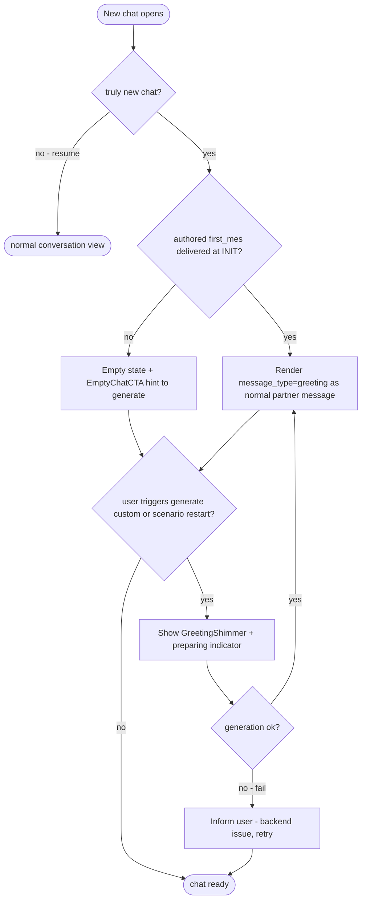

# Character Data & Chat-Start — Frontend & UX Concept

> **Scope owner:** Frontend & UX architect (this doc).
> **Aligns to:** [`01-data-and-engine-concept.md`](01-data-and-engine-concept.md) (data/backend backbone — decisions there are treated as fixed; conflicts are *flagged*, never silently overridden). Tracks the backbone's greeting ownership (§3.1 / §3.6: engine-authoritative, app render-only, authored `first_mes` at init for new chats only) and lorebook mechanism (§1.4: RAG semantic).
> **Mode:** Brainstorming/planning — flows + component sketches + trade-offs + a **recommended** path. No implementation code.
> **Repo (where the UI lives):** `harmony-ai-app` — React Native 0.86 + TypeScript, React Native Paper MD3, React Navigation. Obsidian Glass aesthetic (see [`systemPatterns.toon`](memory-bank/systemPatterns.toon) @Glassmorphism).

---

## 0. Executive summary — headline UX recommendations

| Area | Recommendation |
|---|---|
| **Empty-state strategy (the core fix)** | A new chat **never opens to a bare list + input**. If the card has an authored `first_mes`, the engine delivers it at `INIT_ENTITY` and the app renders a [`GreetingBubble`](#51-greetingbubble) instantly (render-only). If there is **no** `first_mes`, the chat opens **empty** with an [`EmptyChatCTA`](#54-emptychatcta) hint pointing to the greeting generator. While the user **generates** a custom greeting (random/directed/scenario-restart), show a **"preparing"** [`GreetingShimmer`](#513-greetingshimmer) + [`TypingIndicator`](src/components/chat/TypingIndicator.tsx) until the `message_type="greeting"` message arrives. No local fabrication, no reconciliation. |
| **Autonomous vs guided default** | **Autonomous by default** (zero friction — directly addresses "struggle to start"). Guided is an *opt-in, non-blocking* affordance (a "Scenario…" sparkle pill above the composer + a per-character `greeting_policy`). No blocking wizard on open. |
| **Greeting default policy** | **Authored-first** (matches backbone §3.2). `greeting_policy ∈ {authored, generate, ask}`; global default `authored`, overridable per-profile + quick-toggle in chat header. The authored `first_mes` is delivered at init regardless; **no auto-generation** — a card with no `first_mes` opens **empty + "generate" hint**. `generate`/`ask` only surface the custom-generation affordance. |
| **Guided-input transport (UX view)** | **Single `GENERATE_GREETING` event.** `INIT_ENTITY` always fires immediately (authored `first_mes` synchronous); every custom / regenerate / scenario-restart greeting is a follow-up `GENERATE_GREETING` (decoupled from session lifecycle). See §2.3. |
| **Swipe model** | Authored `first_mes` + `alternate_greetings[]` as horizontal **swipes** with chevrons + `2 / 4` indicator (a11y-safe; reduced-motion = chevrons only). **Authored swipes ship in P1** (JSON column, no generation); **regenerate-swipe** is gated on P2 generation. |
| **Lorebook editor** | Summary section in the profile editor → **`LorebookViewerSheet`** (bottom sheet) → per-entry **`LorebookEntryEditor`**. Matching is **semantic** (backbone §1.4): keyword/position/budget fields are shown as "preserved for export", and the per-entry hint reads "retrieved when the conversation is semantically related to this entry". An optional **"Test match"** runs a semantic query (type a phrase → top-matching entries). |
| **Profile editor additions** | New sections: **Greeting** (live-preview bubble), **Alternate Greetings** (manager), **Attribution & Provenance** (creator/notes/version/source), **Tags**, **Lorebook**, and an **Advanced** group (`post_history_instructions`, `mes_example`). Plus a **"Preview opening / Test scenario"** affordance. |
| **Import** | Post-import **`ImportReviewSheet`**: shows what was detected (greeting? alt-greetings count? lorebook entries? tags? provenance), review/edit before save, and a "no greeting → generate/write one" CTA. |
| **New components** | `GreetingBubble`, `AlternateGreetingSwiper`, `ScenarioGeneratorSheet`, `EmptyChatCTA`, `GreetingEditor`, `AlternateGreetingsManager`, `LorebookViewerSheet`, `LorebookEntryEditor`, `CreatorAttributionBadge`, `TagChips`, `ImportReviewSheet`, `ScenarioPreferencePicker`, `GreetingShimmer`. All compose existing Obsidian Glass primitives. |
| **Reduced motion** | Shimmer → static skeleton; swipe gesture → chevrons only; streaming typing dots → single static ellipsis. |

---

## 1. Chat-start onboarding flow (the "stop struggling to start" fix)

### 1.1 Today's gap (grounded)

[`ChatDetailScreen.tsx`](src/screens/ChatDetailScreen.tsx) opens a new chat with `messages = []` (loaded via `getRecentConversationMessages` at [`:253`](src/screens/ChatDetailScreen.tsx:253)), gates the view behind an `ActivityIndicator` overlay until `isReadyToShow` ([`:1138`](src/screens/ChatDetailScreen.tsx:1138)), then renders a [`FlatList`](src/screens/ChatDetailScreen.tsx:1316) with **no `ListEmptyComponent`** and a [`ChatInput`](src/screens/ChatDetailScreen.tsx:1413). Result: a brand-new chat is an **empty list + an input bar**. There is no greeting, no empty-state CTA, no "the character is here" signal. Route params come from [`AppNavigator.tsx:43`](src/navigation/AppNavigator.tsx:43): `{ interactionId, participantKey?, participantIds?, entityId(=own), entityName? }`.

### 1.2 The new opening state (recommended)

The instant a **new** chat is detected (truly new — no prior interaction and zero messages, mirroring the backbone's greeting-hook gate §3.4), the screen renders a **partner-side [`GreetingBubble`](#51-greetingbubble)** with the engine-delivered authored `first_mes`, or — if the card has none — an empty state with a "generate a greeting" hint. The app does **not** resolve authored-vs-generated and holds **no local copy**; it only renders what the engine delivers (engine-authoritative, backbone §3.1/§3.6). Two render states for the bubble:



**Concrete states for the opening [`GreetingBubble`](#51-greetingbubble):**

| State | Trigger | What the user sees | Data source |
|---|---|---|---|
| **Preparing (shimmer)** | user triggered a generation (random/directed/scenario-restart); greeting not yet arrived | A partner bubble skeleton + [`TypingIndicator`](src/components/chat/TypingIndicator.tsx) ("preparing an opening…") with a [`GreetingShimmer`](#513-greetingshimmer). No streaming — the greeting arrives whole on completion. | engine (in flight) |
| **Arrived** | the `message_type="greeting"` message arrives — authored from `INIT_ENTITY` (instant) *or* generated | The greeting rendered as a normal glass partner message, `{{user}}`/`{{char}}` resolved. | engine-delivered `message_type="greeting"` message |

> No-bubble case: if the card has **no** `first_mes` and the user has not generated one, there is no `GreetingBubble` — the screen shows an [`EmptyChatCTA`](#54-emptychatcta) hint pointing to the greeting generator (the authored `first_mes` is never fabricated client-side).

> **No reconciliation (aligned to backbone §3.6):** the app holds **no local copy** of the greeting to reconcile — it renders the message when it arrives, exactly like any other incoming partner message. There is no optimistic placeholder, no sentinel, and no replace/suppress logic. The authored `first_mes` arrives at init (instant); only a user-triggered generation shows the "preparing" shimmer. If the card has no `first_mes`, there is no greeting to render until the user generates one (empty state + CTA).

### 1.3 The "How do you want to begin?" moment

**Recommendation: do NOT force a choice on every new chat.** A blocking "pick a mode" sheet on open *is* the friction users complain about. Instead:

- **Default path = autonomous.** On open, the greeting (authored or generated per policy) appears with **zero taps**.
- **Guided is a non-blocking affordance:** a small glass "✨ Scenario…" [`EmptyChatCTA`](#54-emptychatcta) pill rendered **above** the [`ChatInput`](src/components/chat/ChatInput.tsx) on the opening turn (only while the chat has ≤1 message). Tapping it opens the [`ScenarioGeneratorSheet`](#52-scenariogeneratorsheet). Ignoring it = autonomous.
- **Where the choice lives:**
  - **Per-profile:** a `greeting_policy` selector in [`CharacterProfileEditScreen`](src/screens/CharacterProfileEditScreen.tsx) (§3).
  - **Per-chat quick toggle:** in the chat header overflow menu (alongside existing actions) — a [`ScenarioPreferencePicker`](#511-scenariopreferencepicker) offering *Use card greeting / Generate fresh / Ask me each time*.

```
┌──────────────────────────────────────────────┐
│  ◀  Marcella                          ⋮       │   <- ScreenHeader (avatar+name)
├──────────────────────────────────────────────┤
│                                              │
│        ╭─────────────────────────────╮       │
│        │ Hey… you came. I wasn't      │       │   <- GreetingBubble (authored first_mes)
│        │ sure you would. *leans back* │       │
│        ╰─────────────────────────────╯       │
│         ‹  1/3  ›        ✨ Scenario…         │   <- AlternateGreetingSwiper + EmptyChatCTA
│                                              │
├──────────────────────────────────────────────┤
│  [😊]  Type a message…               [▲ send]│   <- ChatInput
└──────────────────────────────────────────────┘
```

### 1.4 Alternate greetings as "swipes" (SillyTavern-style)

The opening [`GreetingBubble`](#51-greetingbubble) is wrapped in an [`AlternateGreetingSwiper`](#52-alternategreetingswiper):

- **Swipes** cycle the opener through `[first_mes, …alternate_greetings[]]`.
- **Chevrons** `‹ / ›` + a **position indicator** `2 / 4` (always visible for a11y and discoverability).
- **Reduced motion:** swipe gesture disabled; chevrons remain the only control.
- **Regenerate / "Generate another":** when the user reaches the last authored greeting and swipes further (or taps **⟳ Generate another**), the app requests a fresh engine generation (P2). While generating, the next swipe slot shows a shimmer. **Generated greetings are ephemeral messages** — only the *chosen* opener is persisted as the greeting (backbone §3.5); authored `alternate_greetings` always round-trip as card data.
- **Empty-data fallback:** a card with **no** `alternate_greetings` shows only `1 / 1` and exposes the **⟳ Generate another** affordance (P2) so users can still get variety.

---

## 2. Dynamic scenario-generation UX (autonomous vs guided)

### 2.1 Autonomous (one-tap)

- **Zero input (random mode).** The engine builds the scenario prompt from the profile alone (backbone §3.3: falls back `scenario → description → backstory → mes_example → first_mes` as style cue), pulling relevant lore via RAG (backbone §1.4). This is **user-initiated** (never automatic) — it runs when the user taps "generate" from an empty chat or a regenerate swipe.
- **Loading UX:** generation is **user-initiated** (random or directed); the app shows a **"preparing"** [`GreetingShimmer`](#513-greetingshimmer) + typing indicator while it runs. The greeting arrives whole on completion (**no streaming**). The authored `first_mes`, when present, was already delivered at init and rendered instantly — no shimmer for that path.
- **Failure handling (engine-side, mirror of backbone §3.2):** on generation failure the **engine** does not fabricate a fallback; it signals failure and the app **informs the user there is an issue with the backend** (non-blocking toast / retry). The chat stays as it was (authored greeting still present, or empty). **No generic placeholder is ever shown.**

### 2.2 Guided (the [`ScenarioGeneratorSheet`](#52-scenariogeneratorsheet))

A **bottom sheet** (not a full-screen wizard) — target fill time **< 30 s**. Inputs:

| Input | Control | Notes |
|---|---|---|
| **Mood / Tone** | Multi-select **chips** | playful, tense, romantic, mysterious, melancholic, adventurous, cozy, humorous… |
| **Setting / Location** | Free text + quick suggestions | e.g. "a rain-soaked alley", "the café at dawn" |
| **Relationship to user** | `SelectPicker` | stranger, friend, rival, mentor, romantic partner, family, enemy… |
| **Time of day** | Chips (optional) | dawn, day, dusk, night |
| **Who speaks first** | Toggle | character (default) / user |
| **Scene premise** | Free text (multiline) | the "what's happening right now" |

- A **"Surprise me"** button clears all inputs = autonomous (the user always has a one-tap exit).
- On **Generate** (directed mode), the sheet collapses and the composer area shows a **"preparing"** [`GreetingShimmer`](#513-greetingshimmer) until the generated greeting arrives whole, then renders it as a normal partner message; the generated opener becomes the first message of the chat.

```
┌──────────────────────────────────────────────┐
│  Set the scene                       ✕        │   <- ScenarioGeneratorSheet (bottom sheet)
├──────────────────────────────────────────────┤
│  Mood                                         │
│  ( playful )( tense )( romantic )( + more )  │   <- TagChips (multi)
│                                               │
│  Setting                                      │
│  ┌─────────────────────────────────────┐     │
│  │ a quiet library after hours         │     │
│  └─────────────────────────────────────┘     │
│                                               │
│  Relationship        Who starts               │
│  [ strangers   ▾ ]   ( ●Marcella  ○You )      │
│                                               │
│  Premise (optional)                           │
│  ┌─────────────────────────────────────┐     │
│  │ We're hiding from the rain…         │     │
│  └─────────────────────────────────────┘     │
│                                               │
│   🎲 Surprise me        [  Generate opening ] │
└──────────────────────────────────────────────┘
```

### 2.3 Transport recommendation (the open "guided-input" decision)

**Recommendation: single dedicated `GENERATE_GREETING` event (pure).**

1. **`INIT_ENTITY` never carries generation parameters.** It always fires immediately and the engine delivers the authored `first_mes` synchronously at init (backbone §3.4) — or nothing if the card has none. This keeps the init greeting hook synchronous and idempotent, and the user never sees a bare empty chat (the authored greeting is there, or the empty + "generate" hint is).
2. **One event for every generation path:** the dedicated **`GENERATE_GREETING` event** carries `{ mode: 'random'|'directed', guided?: { mood, setting, relationship, timeOfDay, whoFirst, premise } }` and serves the **first** custom greeting, **regenerate** ("generate another"), and **scenario restart** alike. Rationale:
   - Regeneration must **not** tear down and re-init the session (re-init has resume/idempotency guards and re-syncs). A dedicated event maps 1:1 to the regenerate/scenario-restart affordances and keeps the init greeting hook's idempotency intact.
   - A guided *first* greeting is simply: `INIT_ENTITY` (authored greeting lands) → user opens the [`ScenarioGeneratorSheet`](#52-scenariogeneratorsheet) → `GENERATE_GREETING` with guided inputs (which replaces the authored opener while still on the opening turn, per the regenerate precondition in backbone §3.5).

**Rejected alternative (hybrid — carrying `greeting_request` on `INIT_ENTITY`):** would save one round-trip for a guided *first* greeting, but it (a) couples guided logic into the synchronous init hook, (b) creates a timing assumption ("can the app hold `INIT_ENTITY` until the user confirms inputs?") with no clean answer, and (c) adds a second transport surface for a marginal gain — the authored greeting already removes the "bare empty chat on open" problem the hybrid was trying to solve. → This resolves the former §7 conflict #1.

### 2.4 Per-character / per-chat scenario preference

- **`greeting_policy`** enum: `authored` (default) · `generate` · `ask`. (The authored `first_mes` is delivered at init regardless; `generate`/`ask` only govern whether the app **also** surfaces/launches the custom-generation affordance at open. A card with no `first_mes` always shows the empty + "generate" hint.)
- Stored **per-profile** (a small column or a key in a JSON prefs object) + a **global default** in settings.
- Surfaced in two places: the profile editor ([`ScenarioPreferencePicker`](#511-scenariopreferencepicker)) and a **quick toggle in the chat header overflow menu** for per-chat overrides (persisted to `ChatPreferencesService`, same pattern as the existing reply-mode preference at [`ChatDetailScreen.tsx:237`](src/screens/ChatDetailScreen.tsx:237)).

---

## 3. Character profile management UX

Extends [`CharacterProfileEditScreen.tsx`](src/screens/CharacterProfileEditScreen.tsx), which today edits `name/description/personality/appearance/backstory/voiceCharacteristics/typingSpeedWpm/audioResponseChance/basePrompt/scenario/exampleDialogues` (state at [`:60`](src/screens/CharacterProfileEditScreen.tsx:60)) and already composes [`ThemedCard`](src/components/themed/ThemedCard.tsx), [`SectionHeader`](src/components/themed/SectionHeader.tsx), [`ScreenHeader`](src/components/themed/ScreenHeader.tsx), [`ThemedButton`](src/components/themed/ThemedButton.tsx), and [`useAppAlert`](src/contexts/AppAlertContext.tsx).

### 3.1 Proposed section layout

```
CharacterProfileEditScreen
├─ Identity            (name, NICKNAME, description)         <- nickname drives {{char}}
├─ Voice & Persona     (personality, voice, mes_example)     <- mes_example promoted here
├─ GREETING            (first_mes + LIVE PREVIEW bubble)     <- §3.2 (the headline editor)
│   └─ Alternate Greetings manager (add/edit/reorder/delete/mark-default)
├─ Scenario            (scenario, with helper text)
├─ Lorebook            (summary card → LorebookViewerSheet)  <- §3.3
├─ Attribution         (creator, creator_notes, character_version, SOURCE[locked], tags)
└─ Advanced  (collapsible)
    ├─ post_history_instructions (UJB)  + explainer tooltip
    ├─ base_prompt (system_prompt / {{original}})
    ├─ greeting_policy picker
    └─ Harmony extensions (appearance, typing_speed, audio_response_chance)
+ [Preview opening] / [Test scenario generation]  action bar
```

### 3.2 Greeting editor + live preview

- A [`GreetingEditor`](#55-greetingeditor) for `first_mes`: multiline `TextInput` with a **live [`GreetingBubble`](#51-greetingbubble) preview** directly beneath it, rendering the typed text exactly as it will appear at chat start (macros resolved: `{{user}}` → own entity name, `{{char}}` → name/nickname). This is the single highest-leverage authoring improvement.
- **Alternate Greetings manager** ([`AlternateGreetingsManager`](#56-alternategreetingsmanager)): a reorderable list (drag handle) of opener cards, each with a mini preview, edit/delete, and a **"default" radio** (which one is `first_mes` vs an `alternate_greeting`). Count badge. Empty-state hint: *"Add alternate openers users can swipe between."*
- **`mes_example`** promoted into *Voice & Persona* (it's few-shot voice guidance, not a greeting) — fixes the backbone's "buried into `example_dialogues`" mangling at the UX level too.

### 3.3 Lorebook editor

- A **summary card** in the editor: *"Lorebook · 12 entries · 2 constant · scan depth 5"*. Tap → [`LorebookViewerSheet`](#57-lorebookviewersheet) (bottom sheet) listing entries (enabled/disabled, key preview, constant badge).
- Per-entry [`LorebookEntryEditor`](#58-lorebookentryeditor): `content` (multiline) is the **primary** field (it's what gets embedded and matched semantically). The keyword/position fields — `keys[]`, `selective` + `secondary_keys`, `constant`, `position` (`before_char`/`after_char`), `insertion_order`, `case_sensitive`, `use_regex`, `name`/`comment` — are shown under a **collapsible "Advanced — preserved for export"** group: they round-trip to the card on export but **do not drive matching** (backbone §1.4). **Sensible defaults:** `enabled=true`, `position=before_char`, `insertion_order=10`.
- **Non-power-user usability:** each entry shows a live hint — *"Retrieved when the conversation is semantically related to this entry"* — because matching is **semantic**, not keyword-gated (backbone §1.4). The optional **"Test match"** affordance becomes a **semantic query test**: type a phrase → see the top-matching entries ranked by similarity (see flagged dependency §7 #3).

### 3.4 Attribution, provenance & tags

- **[`CreatorAttributionBadge`](#59-creatorattributionbadge)** in an *Attribution* section and on card detail / Discover cards: shows `creator`, `creator_notes` (discoverability is **spec-required** per backbone §4), `character_version`, and a provenance/source badge from `card_provenance`. **`source` is read-only** (spec: append-only, backbone §4).
- **[`TagChips`](#510-tagchips)** editor: add/remove tags with suggestions drawn from existing tags across the library. The same component powers Discover filtering (§4).

### 3.5 Preview / test affordance

- **"Preview opening message"** → renders a mock chat-start with the current `first_mes` (no persistence).
- **"Test scenario generation"** (P2) → triggers an engine `BuildScenarioGreetingPrompt` with the current editor contents and shows the result in a [`GreetingBubble`](#51-greetingbubble) clearly marked *Preview*. Lets authors iterate on greetings/scenarios before saving.

---

## 4. Discovery & import UX

### 4.1 Import flow (improve the current header action + speed-dial)

Today: [`CharactersScreen.tsx`](src/screens/CharactersScreen.tsx) has a speed-dial FAB (`expanded`/`expandAnim` at [`:79`](src/screens/CharactersScreen.tsx:79)) and a header "Import Card" action, calling `importCharacterCardFromFile` via `@react-native-documents/picker` `pick`. After import it just toasts success/failure.

**Recommended addition — [`ImportReviewSheet`](#512-importreviewsheet):** after parse, *before* persisting, show what was detected:

```
┌──────────────────────────────────────────────┐
│  Imported: Marcella                    ✕      │   <- ImportReviewSheet
├──────────────────────────────────────────────┤
│  [avatar]  Marcella         chara_card_v3     │   <- provenance badge
│            by CardAuthor · v2.1               │
│                                               │
│  ✓ Greeting (first_mes)        1,204 chars    │
│  ✓ Alternate greetings         3              │
│  ✓ Lorebook entries            8              │
│  ✓ Tags: romance, slow-burn, enemies-to-lovers│
│  ⚠ No example dialogue (mes_example)          │
│                                               │
│   ✏ Review & edit fields                       │
│   ⟳ Generate a greeting  (if none detected)   │
│                                               │
│              [ Cancel ]   [ Save character ]  │
└──────────────────────────────────────────────┘
```

- **"Review & edit fields"** deep-links into the editor sections (§3) pre-filled from the card.
- **No-greeting case:** a prominent **"Generate a greeting"** CTA (P2) or a prompt to author one — never silently save a card that will open **empty** (no `first_mes` ⇒ no greeting until the user generates one).

### 4.2 Discover + tag filtering

[`DiscoverScreen.tsx`](src/screens/DiscoverScreen.tsx) (uses the `discover` i18n namespace) gains:

- A horizontal **[`TagChips`](#510-tagchips) filter row** (multi-select) above the card grid, sourced from `tags` (SQLite JSON1 `json_each(tags)` for v1 — backbone open decision #4 notes a join table is the P4 upgrade if perf demands).
- **[`CreatorAttributionBadge`](#59-creatorattributionbadge)** on each card; tap creator to filter.
- Search continues to work alongside tag filters.

---

## 5. Components & theming

### 5.1–5.13 New components

| # | Component | Purpose | Props (sketch) | Composes (existing) | Glass/theming notes |
|---|---|---|---|---|---|
| 5.1 | [`GreetingBubble`](src/components/chat) | Render the engine-delivered greeting as a normal partner message (2 states: `preparing` / `arrived`); macro-resolved text | `text`, `state` (`'preparing'\|'arrived'`), `partnerName`, `partnerAvatar?`, `onRegenerate?` | [`ThemedCard`](src/components/themed/ThemedCard.tsx), [`ThemedText`](src/components/themed/ThemedText.tsx), [`TypingIndicator`](src/components/chat/TypingIndicator.tsx) | Partner-side glass bubble (`accentStripe` left edge); shimmer overlay only in `preparing` |
| 5.2 | `AlternateGreetingSwiper` | Horizontal pager over `[first_mes, …alternate_greetings]` + regenerate slot | `greetings[]`, `index`, `onIndexChange`, `onGenerateAnother`, `canGenerate` | `GreetingBubble`, [`ThemedButton`](src/components/themed/ThemedButton.tsx) (chevrons) | Position pill = small glass chip; reduced-motion = chevrons only |
| 5.3 | `ScenarioGeneratorSheet` | Bottom-sheet guided-input collector (§2.2) | `open`, `onClose`, `onGenerate(guidedInputs)`, `suggestions` | [`ThemedCard`](src/components/themed/ThemedCard.tsx), `TagChips`, [`SelectPicker`](src/components/config/SelectPicker.tsx), [`ThemedButton`](src/components/themed/ThemedButton.tsx) | Elevated translucent sheet + gradient border; chips = glass pills |
| 5.4 | `EmptyChatCTA` | Non-blocking "✨ Generate a greeting / Scenario…" hint CTA shown when a new chat has no `first_mes` (§1.2) | `onGenerate`, `variant` | [`ThemedButton`](src/components/themed/ThemedButton.tsx) | Pill = secondary glass inner (per [`systemPatterns.toon`](memory-bank/systemPatterns.toon) @Glassmorphism consumers) |
| 5.5 | `GreetingEditor` | `first_mes` editor with live preview bubble (§3.2) | `value`, `onChange`, `ownName`, `charName` | `TextInput`, `GreetingBubble`, [`SectionHeader`](src/components/themed/SectionHeader.tsx) | Preview reuses `GreetingBubble` styling |
| 5.6 | `AlternateGreetingsManager` | Reorderable list of openers; mark default | `greetings[]`, `onChange`, `defaultIndex` | [`ThemedCard`](src/components/themed/ThemedCard.tsx) list, drag handle, [`ThemedButton`](src/components/themed/ThemedButton.tsx) | Drag handle = muted icon; default = accent radio |
| 5.7 | `LorebookViewerSheet` | Browse/search entries for a profile | `profileId`, `open`, `onClose`, `onEditEntry` | [`ThemedCard`](src/components/themed/ThemedCard.tsx), `FlatList` | Entry rows = glass cards; constant/enable badges |
| 5.8 | `LorebookEntryEditor` | Create/edit one entry (§3.3) | `entry`, `onChange`, `onTestMatch?` (semantic query) | [`ThemedCard`](src/components/themed/ThemedCard.tsx), [`SelectPicker`](src/components/config/SelectPicker.tsx), toggles | Keyword/position fields collapsed under "Advanced — preserved for export"; "retrieved when semantically related" hint = muted text |
| 5.9 | `CreatorAttributionBadge` | creator/notes/version/source (spec-required discoverability) | `creator`, `creatorNotes`, `version`, `source` | [`ThemedText`](src/components/themed/ThemedText.tsx), [`ThemedCard`](src/components/themed/ThemedCard.tsx) | Small glass chip; `source` read-only styling |
| 5.10 | `TagChips` | Tag editor **and** Discover filter (dual-use) | `tags[]`, `onChange?`/`selected?`, `suggestions`, `mode` | [`ThemedButton`](src/components/themed/ThemedButton.tsx) | Pill = glass; selected = accent fill |
| 5.11 | `ScenarioPreferencePicker` | `greeting_policy` selector | `value`, `onChange` | [`SelectPicker`](src/components/config/SelectPicker.tsx) | Reuses existing dropdown styling |
| 5.12 | `ImportReviewSheet` | Post-import review/preview (§4.1) | `parsedCard`, `onSave`, `onEdit`, `onGenerateGreeting?` | [`ThemedCard`](src/components/themed/ThemedCard.tsx), [`ThemedButton`](src/components/themed/ThemedButton.tsx), [`useAppAlert`](src/contexts/AppAlertContext.tsx) | Detected-item rows with ✓/⚠ icons |
| 5.13 | `GreetingShimmer` | Skeleton for in-flight greeting | (none) | [`ThemedCard`](src/components/themed/ThemedCard.tsx) skeleton | Accent-primary low-opacity sweep; **reduced-motion → static skeleton** |

**Reused as-is:** [`ChatBubble`](src/components/chat/ChatBubble.tsx), [`ChatInput`](src/components/chat/ChatInput.tsx), [`NewMessagesDivider`](src/components/chat/NewMessagesDivider.tsx), [`ProfileImagePicker`](src/components/characters/ProfileImagePicker.tsx), [`CharacterProfileCard`](src/components/characters/CharacterProfileCard.tsx), [`DynamicAtmosphericBackground`](src/components/background/DynamicAtmosphericBackground.tsx), [`ScreenHeader`](src/components/themed/ScreenHeader.tsx), [`SectionHeader`](src/components/themed/SectionHeader.tsx), [`ThemedAppbar`](src/components/themed/ThemedAppbar.tsx), [`ThemedFab`](src/components/themed/ThemedFab.tsx), [`ThemedView`](src/components/themed/ThemedView.tsx), [`useAppAlert`](src/contexts/AppAlertContext.tsx).

### 5.14 i18n (new keys)

New **`scenario`** namespace (for generation/onboarding strings) **+ extensions to `characters` and `chatDetail`**. Locale files live in [`src/i18n/locales/en/`](src/i18n/locales/en/).

| Namespace | Sample new keys |
|---|---|
| **`scenario` (new)** | `title`, `ctaScenario`, `mood`, `setting`, `relationship`, `timeOfDay`, `whoStarts`, `premise`, `surpriseMe`, `generate`, `generating`, `generateAnother`, `policyAuthored`, `policyGenerate`, `policyAsk`, `preparingOpening` ("preparing an opening…"), `generateFailedBackend` ("couldn't generate — issue with the backend"), `noGreetingHint` ("no opening message yet — generate one"), `scenarioRestart` |
| **`characters` (extend)** | `greeting`, `greetingHint`, `alternateGreetings`, `addAlternate`, `markDefault`, `mesExample`, `postHistoryInstructions`, `postHistoryHint`, `nickname`, `creator`, `creatorNotes`, `characterVersion`, `source`, `tags`, `addTag`, `lorebook`, `lorebookEmpty`, `lorebookEntryRetrievedWhen` ("retrieved when the conversation is semantically related to this entry"), `lorebookFieldsExportOnly`, `advanced`, `previewOpening`, `testScenario`, `importReviewTitle`, `importGreetingDetected`, `importNoGreeting`, `generateGreeting` |
| **`chatDetail` (extend)** | `swipeIndicator` (`"{{n}}/{{total}}"`), `scenarioSheetTitle` |

### 5.15 Accessibility & motion

- **Reduced motion** (honor platform setting): [`GreetingShimmer`](#513-greetingshimmer) → static skeleton; swipe gesture → chevrons only; "preparing" typing-dots → single static ellipsis; sheet open animation → cross-fade.
- All interactive affordances have `accessibilityLabel`/`accessibilityRole` (chevrons = buttons, chips = toggle buttons, position indicator = text).
- Color is never the sole signal: state badges carry icons (⟳ generate, ✓ arrived/authored, ⚠ backend-issue).

---

## 6. Default policy & phasing (UX view)

### 6.1 Open decisions — UX stance

| Decision | UX recommendation | Why |
|---|---|---|
| **Greeting default policy** | **Authored-first** (`greeting_policy=authored` global default). The authored `first_mes` is delivered at init regardless; "Generate"/"Ask" only surface the custom-generation affordance. A card with no `first_mes` opens empty + hint. | Lowest friction, free, deterministic. Real cards universally have `first_mes` (533–5352 chars, per research brief). Matches backbone §3.2 default. |
| **Guided-input transport** | **Single `GENERATE_GREETING` event** (§2.3): `INIT_ENTITY` always fires immediately (authored greeting synchronous); every custom/regenerate/scenario greeting is a follow-up `GENERATE_GREETING`. | Keeps the init hook synchronous + idempotent; no timing assumption; regenerate doesn't re-init the session. |
| **Alternate-greetings swipe: P1 or P2?** | **Authored swipes = P1** (JSON column lands P1, no generation); **regenerate-swipe = P2** (needs generation hook). | Delivers the flagship swipe UX with zero engine dependency in P1. |
| **Tags storage (backbone #4)** | JSON column for v1 is fine for UX; build Discover filtering on `json_each`. Revisit join table at P4 only if list perf degrades. | Doesn't block the Discover filter UX today. |

### 6.2 UX → backend phase mapping

| UX capability | Gated on | Phase |
|---|---|---|
| Empty-state [`GreetingBubble`](#51-greetingbubble) rendering the engine-delivered **authored** `first_mes` (render-only, new chats); authored **swipes**; `GreetingShimmer`; `GreetingEditor` + `AlternateGreetingsManager`; `ImportReviewSheet`; `CreatorAttributionBadge` + `TagChips` editor; macro resolution; empty + "generate" hint when no `first_mes` | Migration `000036` (profile columns incl. `character_book` JSON) + importer stops burying `first_mes` | **P1** |
| **"Preparing" shimmer**; **generate/regenerate** swipes; `EmptyChatCTA` → engine generate; `ScenarioGeneratorSheet` (guided) plumbing; **"Test scenario generation"**; **scenario restart** (new scene) | P2 engine generation hook (`BuildScenarioGreetingPrompt`, `GENERATE_GREETING`, `DeliverGreeting`) | **P2** |
| **[`LorebookViewerSheet`](#57-lorebookviewersheet) + [`LorebookEntryEditor`](#58-lorebookentryeditor)**; "retrieved when semantically related" hints; semantic "Test match"; `post_history_instructions`/`{{original}}` surfacing in editor; guided mode full UX | Engine **RAG semantic retrieval** (lorebook is the `character_book` JSON column from `000036`) | **P3** |
| **Discover tag filtering** (and join-table upgrade if needed); **export** affordance in editor (round-trip) | Exporter + tags first-class | **P4** |

> **Note:** the [`GreetingShimmer`](#513-greetingshimmer) (render-only) can ship in P1 — against the authored `first_mes` the engine delivers at init (near-instant, so the shimmer is barely visible); once P2 lands, the same component covers the generated-greeting wait. There is **no reconciliation layer** to build (the app renders whatever arrives).

---

## 7. UX assumptions / conflicts flagged for the orchestrator

1. **Lorebook "Test match" is a semantic query.** Showing the top-matching entries for a typed phrase requires an **engine semantic-retrieval call** (the app has no embedding model). This optional P3 nicety is arguably more useful than a keyword fire-list; the static "retrieved when semantically related" *hint* ships without it.
2. **`source` mutability.** UX renders `source`/provenance **read-only** (spec: append-only, backbone §4). Confirmed non-conflicting — flagged only so the editor enforces it.
3. **No group chats yet.** `group_only_greetings` is round-tripped (JSON) but has **no UI surface** today (Harmony has no group chats). Confirmed non-conflicting; deferred.

**Decision log:**
- **Greeting delivery — engine-authoritative, app render-only.** The engine delivers the authored `first_mes` at `INIT_ENTITY` (truly-new chats only); the app renders it. `GreetingBubble` has **2 states** (Preparing / Arrived). No local `first_mes`, no optimistic placeholder, no reconciliation.
- **Guided-input transport — single `GENERATE_GREETING` event.** `INIT_ENTITY` always fires immediately (authored `first_mes` synchronous); every custom / regenerate / scenario-restart greeting is a follow-up `GENERATE_GREETING` (§2.3). No `greeting_request` on `INIT_ENTITY`; the init hook stays synchronous and idempotent.
- **Backward-compat cards — out of scope.** Nothing is deployed yet (initial dev); dev databases are wiped + re-imported with the new mapper, so there is no pre-migration card corpus and no "old card" UX to design (backbone §2.3).
- **No streaming** — the backend has no streaming capability; the "preparing" shimmer is the sole latency affordance (the greeting arrives whole).
- **No reconciliation** — the app holds no local greeting copy; it renders the engine-delivered message.
- **No generic placeholder / no auto-generation** — a card with no `first_mes` opens empty + hint; generation is user-initiated (random/directed/scenario-restart). On failure the user is informed of a backend issue, never a fabricated fallback.
- **Lorebook = RAG semantic retrieval** — matching is semantic, not keyword/regex; keyword/position/budget fields are stored for export, not used for matching. The lorebook editor + semantic "Test match" land in **P3** (lorebook is the `character_book` JSON column from `000036`).

---

### Appendix A — Chat-start journey (ASCII, autonomous default)

```
ChatListScreen
   │ tap entity-with-no-interaction (ChatListScreen.tsx:412)
   ▼
ChatDetailScreen  ── messages=[] , !resumed  ──►  render GreetingBubble(authored, instant)
   │                                                    │
   │  (user ignores Scenario pill)                      │ swipe ‹ › cycles alt-greetings
   │                                                    │ tap ⟳ → GENERATE_GREETING (P2)
   ▼                                                    ▼
ChatInput  ── first user message ──►  normal conversation flow
```

### Appendix B — Guided journey (ASCII)

```
ChatDetailScreen (new chat)
   │  INIT_ENTITY fires immediately ──► authored first_mes rendered (or empty + hint)
   │  greeting_policy = ask  ──►  EmptyChatCTA "✨ Scenario…" pill shown
   ▼  tap pill
ScenarioGeneratorSheet  ── mood/setting/relationship/time/who-first/premise ── "Generate"
   ▼
GENERATE_GREETING { mode:'directed', guided:{…} }   (P2 engine — replaces authored opener while still on opening turn)
   ▼
GreetingBubble(preparing) ──► render persisted greeting row on completion
```
