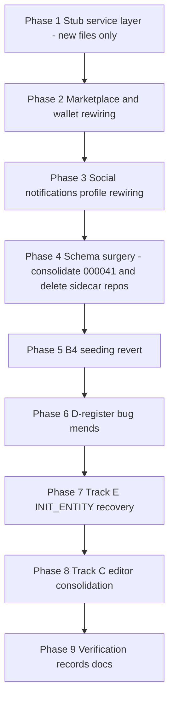

# Senju Follow-Up — Phase 1: Backend Stubs, Parity Prep & Streamlining

> Execution plan for **Phase 1 (app-side only)** of `.current_work/senju-rebase-integration/02-Followup-Stub-Plan.md`.
> Binding directives: senior-dev rulings in `.current_work/senju-rebase-integration/summary.md` (D1–D6, A-rulings, O-rulings) and the stub-layer rules in `03-Pattern-Cheat-Sheet.md` §"Stub-layer rules".
> **Engine-side work is explicitly OUT OF SCOPE** (ENGINE-LAST directive) — Phase 2 gets its own planning round.

## What this phase delivers

1. **Backend-dependent features become honest in-memory stubs** (marketplace, soul wallet, social, notifications, profile) behind service seams whose types pre-match the future backend — screens stay verbatim, only the data layer swaps.
2. **Senju's 15 migrations (000041–000055) consolidate into ONE migration `000041`** containing only the surviving SQL (message actions minus reply-to, personas, character_favorites, chat_conversation_settings); all marketplace/social/wallet sidecar SQL is dropped (user-approved amendment to Track B5).
3. **Schema parity returns to the narrowed D3 set** — the only divergence is `conversation_messages.reactions_json` + `is_pinned` (+ pinned index), which Phase 2's engine mirror closes.
4. **Execution parity with the engine**: default-config seeding reverts to engine-only source (B4), INIT_ENTITY recovery lands (Track E), chat-list/messaging bug mends (Track D registers).
5. **Editor consolidation** (Track C): the V3/RP editor suite ports into CreateAI's edit mode; the comparison-only editor screen is deleted.

## Working agreements (binding for every phase)

- **Branch**: continue directly on `senju-design-updates-rebase` (user decision 2026-08-24). No new branch. Never force-push `senju-design-updates` without the coordinated window with senju (still pending).
- **Every commit green**: `npx tsc --noEmit` = 0 errors, `npm test` green, before each commit. This drove the execution order below (stub services land BEFORE schema surgery so no commit has dangling imports).
- **GitNexus protocol** (AGENTS.md): run `gitnexus_impact` before editing any existing symbol; run `gitnexus_detect_changes()` before each commit; expect stale-index warnings after commits — refresh with `npx gitnexus analyze` when tools warn.
- **Testing**: unit tests next to services, mock the stub backend module (pattern: `src/services/cloud/__tests__/deviceAuth.test.ts`). DB tests use `useFreshDatabase()` fixtures. Migration snapshots regenerate with `npx jest --selectProjects unit --testPathPatterns migrations -u`.
- **No new state-management libraries. No new parity-governed tables.** Stub state is in-memory; lightweight per-device state may use AsyncStorage (existing key conventions only).
- **i18n**: every user-visible string goes through `src/i18n/locales/en/<ns>.json` + registration in `src/i18n/I18nContext.tsx`.
- **Honest stubs**: errors surface as errors / "not yet available" states — never fake-success. In-memory stub success is legitimate (the stub IS the backend); masking failures is not.
- **Docs**: after each phase, update the phase doc's checklist; at the end, Phase 9 writes the record doc + CHANGELOG + memory bank.

## Execution order (content = approved plan; order re-sequenced for green commits)

The plan's Phase-1 list ordered B5 removals first; here stubs land first so that when repos/tables are deleted in Phase 4, nothing imports them. Track content is unchanged.

## Phase overview

| Phase | Doc | Track(s) | Output |
|---|---|---|---|
| 1 | [1-StubServices.md](1-StubServices.md) | A1/A2/A3 core | MarketplaceService, WalletService, SocialService, NotificationService + stub backends + fixtures + tests |
| 2 | [2-MarketplaceWalletRewiring.md](2-MarketplaceWalletRewiring.md) | A1/A2 wiring | Market screens on stubs; paywall gates removed; MarketplaceApiService/PurchaseService deleted; Discover on fixture feed |
| 3 | [3-SocialProfileRewiring.md](3-SocialProfileRewiring.md) | A3/A4 wiring | Social/notification screens on stubs; block list via stub; profile cloud-first; UserProfileStore deleted |
| 4 | [4-SchemaSurgery.md](4-SchemaSurgery.md) | B5 + O4 + A3-tables | Single consolidated 000041; 15 migration files + 5 sidecar repos deleted; CLIENT_ONLY_TABLES → 3; snapshots + schema regen; reply-feature code stripped |
| 5 | [5-SeedingRevert.md](5-SeedingRevert.md) | B4 | ensureSoulbitsDefaultConfigs auto-fill removed; Disabled option restored; engine = single default source |
| 6 | [6-BugMends.md](6-BugMends.md) | D1/D2 registers | F1/F3/F6/F7/F8/F10/F11/F12, reply-mode toggle (A6), recording keep, show() boolean, indicators, dead-code removal |
| 7 | [7-InitEntityRecovery.md](7-InitEntityRecovery.md) | Track E | INIT_ENTITY ingestion-error recovery; skipped test re-enabled |
| 8 | [8-EditorConsolidation.md](8-EditorConsolidation.md) | Track C | V3/RP editor suite in CreateAI edit mode as section components; CharacterProfileEditScreen deleted; image-churn fix |
| 9 | [9-VerificationRecords.md](9-VerificationRecords.md) | wrap-up | Full gates, parity check, record doc, 20-Backend-Concept outline, Phase-2 outline, CHANGELOG, memory bank |

## Implementation Status

Track the completion of each phase as implementation progresses:

- [x] **Phase 1: Stub Service Layer** ([1-StubServices.md](1-StubServices.md))
- [x] **Phase 2: Marketplace & Wallet Rewiring** ([2-MarketplaceWalletRewiring.md](2-MarketplaceWalletRewiring.md))
- [x] **Phase 3: Social, Notifications & Profile Rewiring** ([3-SocialProfileRewiring.md](3-SocialProfileRewiring.md))
- [x] **Phase 4: Schema Surgery & Repo Removal** ([4-SchemaSurgery.md](4-SchemaSurgery.md))
- [ ] **Phase 5: B4 Seeding Revert** ([5-SeedingRevert.md](5-SeedingRevert.md))
- [ ] **Phase 6: D-Register Bug Mends** ([6-BugMends.md](6-BugMends.md))
- [ ] **Phase 7: Track E INIT_ENTITY Recovery** ([7-InitEntityRecovery.md](7-InitEntityRecovery.md))
- [ ] **Phase 8: Track C Editor Consolidation** ([8-EditorConsolidation.md](8-EditorConsolidation.md))
- [ ] **Phase 9: Verification, Records & Docs** ([9-VerificationRecords.md](9-VerificationRecords.md))

## Codebase-mapping documents consulted

`.planning/codebase/` (ARCHITECTURE.md, STRUCTURE.md, CONVENTIONS.md, INTEGRATIONS.md, TESTING.md) — repo-level structural context; `.current_work/senju-rebase-integration/00-Research-Findings.md` §4/§8/§10 and `04-Preference-Alignment-Inventory.md` for the preference/unread forensics referenced in Phase 6.

## Standing open questions (decided defaults; escalate only if blocked)

1. `blocked_users` table dropped; block list lives in the SocialService stub (BlockedUsersScreen keeps working against fixture users). *(default: yes — user-approved proposal)*
2. Devices that already ran builds recording migrations 41–55 need a **one-time dev DB wipe** (dev-only exposure; orphans are otherwise harmless but `reply_to_message_id` lingers unused). *(default: document the wipe)*
3. `MarketplacePurchaseService` deleted; acquire flow folds into `MarketplaceService.acquire()`. *(default: yes)*
4. `chat_conversation_settings.blocked` column name stays until the Phase-2 B2 table rewrite (repo keeps the `'blocked'` storage flag deliberately). *(default: leave)*
5. `21-Engine-Contract-Persona-Enums.md` is drafted in Phase 2's planning round, not now. Phase 9 writes only the outline section. *(default: defer)*
