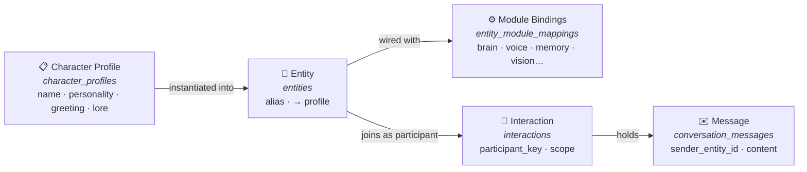
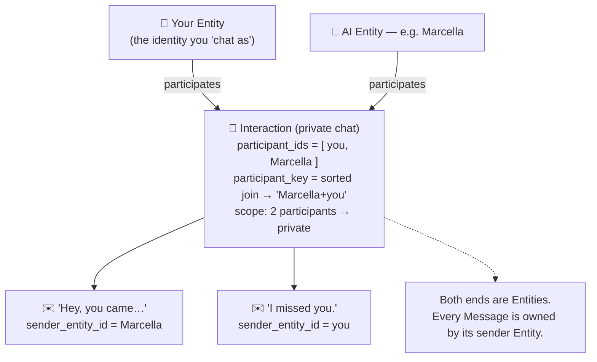

# Entities, Interactions & Character Profiles — A Plain-English Guide

> **Audience:** contributors / team.
> Explains the four core concepts of the Harmony AI App chat model — and, crucially, *why you (the human) are also an "entity".*
>
> Written in simple words, but technically accurate. See the reference table in §5 for exact table/field anchors.

---

## TL;DR

- A **Character Profile** is the *card* — the persona data (name, personality, greeting, voice, lore…). It is a reusable, shareable template.
- An **Entity** is a *living instance* of a profile that actually takes part in chats. It has a brain (cognition), memory, emotions, a voice, and module bindings. **Every participant in a chat is an entity — the AI characters *and* you.**
- An **Interaction** is the *conversation thread* between a set of entities.
- A **Conversation Message** is a single line of dialogue, always stamped with the entity that sent it.
- The **"user entity"** is simply *your* entity. Because the model treats all speakers uniformly, you must impersonate an entity to send messages and be "seen" by the AI. You can be yourself, or roleplay a character — each identity is a separate relationship.

---

## 1. The mental model (analogy)

| Concept | Analogy | One line |
|---|---|---|
| **Character Profile** | A **character sheet / recipe** | "Who they are on paper" — importable, exportable data |
| **Entity** | A **living person** brought to life from the sheet | Has a brain, memory, emotions, a voice; can actually talk |
| **Interaction** | A **chat thread / room** | A conversation scoped to who is in it |
| **Conversation Message** | A **line of dialogue** | One message, tagged with *who said it* |
| **User Entity** | **You**, wearing a name badge | The identity you "chat as" |

---

## 2. The object model

A profile is *data*. An entity is that data *made alive and equipped with modules*. Entities gather inside an interaction, and every message they exchange is recorded with its sender.

---

## 3. The four concepts in plain words

### 3.1 Character Profile — the *card*

Defined in [`CharacterProfile`](src/database/models.ts:13) (table `character_profiles`).

- Pure **persona data**: `name`, `description`, `personality`, `appearance`, `backstory`, `voice_characteristics`, `scenario`, `example_dialogues`, …
- It is a **template/blueprint**, modeled on the community character-card standard (greeting, lorebook, alternate greetings, etc. — see the chat-start concept docs in `.current_work/character-data-chat-start-concept/`).
- It is **stateless on its own** — it cannot talk. It has no memory, no emotions, no modules. It is the *sheet of paper*.
- An entity *references* one profile via [`character_profile_id`](src/database/models.ts:36).

### 3.2 Entity — the *living participant*

Defined in [`Entity`](src/database/models.ts:33) (table `entities`).

- A **living instance** of a character: `id`, `alias` (display name), `character_profile_id`, `lifecycle_config`.
- Wired up with **AI modules** via [`EntityModuleMapping`](src/database/models.ts:44) — cognition (brain), TTS (voice), STT (ears), vision (eyes), RAG (memory), imagination, movement, backend.
- Carries an **inner life**: emotion state, memory, emoji actions — all keyed to the entity.
- **This is what actually participates in a chat.** It is the smallest unit that can send or receive messages.

> 🔑 Key insight: an entity is *not* synonymous with "an AI". The user is an entity too (see §4).

### 3.3 Interaction — the *conversation thread*

Defined in [`Interaction`](src/database/models.ts:448) (table `interactions`).

- A **conversation** scoped to a set of participants:
  - [`entity_id`](src/database/models.ts:450) — the entity this thread is anchored to (whose conversation list it belongs to).
  - [`participant_ids`](src/database/models.ts:453) / [`participant_key`](src/database/models.ts:452) — every entity in the chat, plus a stable derived key (the sorted join of their IDs; empty string for "world").
  - [`interaction_scope`](src/database/models.ts:451) — `private` (2 participants), `group` (3+), or `world`.
  - [`presence_type`](src/database/models.ts:462) — e.g. `'phone'` (the in-app chat surface), `status`, `started_at`, `last_activity_at`.
- Has a lifecycle: it can be active, resumed, ended, or continued into a new interaction.

### 3.4 Conversation Message — a *line of dialogue*

Defined in [`ConversationMessage`](src/database/models.ts:468) (table `conversation_messages`).

- One message inside an interaction: `content`, `message_type` (`text` / `audio` / `image` / `greeting` …), optional media, emotional state.
- **Crucially, it always carries a [`sender_entity_id`](src/database/models.ts:471)** — the entity that said it. There is no nullable "the human typed this" flag.

### 3.5 Presence — where an entity lives (channels & plugins)

An entity doesn't just *exist* — it **lives** in one or more **Presences**: concrete communication channels that carry its contextual reality. A presence separates *where* the entity is (channel context) from *how* it is connected (plumbing). Each active entity session carries one presence.

A presence owns:
- **Presence type** — the channel topology (phone app, game plugin, web, messaging…)
- **Capabilities** — what the entity can do there (audio, vision, movement…)
- **Participant set** — who else is present in this context
- **Perception context** — what the entity currently perceives
- **Output preferences** — TTS output type, reply mode (instant / realistic)

**Plugins are presences.** Harmony Link game plugins and other application plugins act as presence providers: they report the participant set with every message, and the engine derives the interaction scope from it. The engine trusts what the plugin reports — it does *not* model perception asymmetry (e.g. eavesdropping) itself; that is the plugin's responsibility.

| Presence Type | Interaction Scope |
|---|---|
| App / Messaging (1:1) | Private — exactly 2 participants |
| App / Messaging (group) | Group — managed roster |
| **Game Plugin** | Derived from participant set (in-game scenes, NPC dialogue) |
| World (ambient) | World — entity perceives world events |

Key rules:
- An entity can have **zero or more** active presences at once; events are routed to presences, not to entities directly.
- A presence can be **suspended and resumed** (phone session behaviour).
- Multiple presences can feed the **same interaction** (phone + Discord DM with the same partner = one interaction); one presence can host several interactions.
- When a plugin-provided participant set shifts the scope (2 → 3 participants), the current interaction is **closed** and a new one with the new scope is created — scope transitions are interaction boundaries.

> Full detail: [Presence — Entity Channel Context](../harmony-link-private/docs/Cognition-System.md) in the Harmony Link Cognition System docs.

---

## 4. The "user entity": why *you* are an entity too

This is the part that trips people up, so here is the full reasoning.

### Everyone is an entity — by design

The engine treats **every speaker identically**. To build a prompt, track memory, update emotion, or resolve who is in a conversation, the code only ever asks "which entities are participating?" There is **no special-case `if (speaker is the human)` branch**. A speaker is always an [`Entity`](src/database/models.ts:33).

For *your* messages to fit that model, **you must also be an entity.** That entity is your **user entity** — the identity you "chat as".

### Why it has to be this way (the technical reasons)

1. **Uniform participant model.** The engine, prompt builder, sync layer, and scope/participant-key logic are written generically over *entities*. Treating you as an entity means **zero special cases** for the human — the same code path handles group chats, world chats, and 1:1 chats.
2. **Every message needs a sender.** [`sender_entity_id`](src/database/models.ts:471) is non-optional. Your messages must be owned by *some* entity, so you must have one.
3. **Stable relationships & memory per identity.** The AI forms a relationship and accumulates memory scoped to the entity-pair (via [`participant_key`](src/database/models.ts:452)). Your entity gives the AI a stable "person" to remember and relate to.
4. **The `{{user}}` macro.** Character cards reference `{{user}}`; it resolves to *your entity's* name/alias. Without an entity, there is nothing to resolve it to.
5. **Roleplay is a feature, not a workaround.** Because you are "just another entity", you can impersonate **any** character. The AI treats each identity as a distinct conversation partner with its own relationship. That is exactly the "Chatting as" experience.

### The "Chatting as" identity (impersonation)

Your chosen identity is stored by `ChatPreferencesService.getGlobalImpersonatedEntity` (see its use in [`ChatListScreen`](src/screens/ChatListScreen.tsx:343)) and shown in the **"Chatting as"** banner ([`ChatListScreen`](src/screens/ChatListScreen.tsx:654)). You can switch it any time; the chat list is then rooted at that entity (interactions where [`entity_id`](src/database/models.ts:450) = your identity).

### The `'user'` sentinel

When **no** identity has been chosen yet, the literal string `'user'` is used as a placeholder (`impersonatedEntityId ?? 'user'`, with fallback logic in [`ChatListScreen`](src/screens/ChatListScreen.tsx:343) and [`CreateAIScreen`](src/screens/CreateAIScreen.tsx:477)). It is a **safe default so the app can proceed**, not necessarily a real row. As soon as you create/select a real identity, that entity takes over.

---

## 5. Reference: concept → table → key fields

| Concept | Table / interface | Key fields | Purpose |
|---|---|---|---|
| **Character Profile** | [`character_profiles`](src/database/models.ts:13) | `name`, `description`, `personality`, `appearance`, `backstory`, `voice_characteristics`, `scenario`, `example_dialogues` | Persona data / the card (template) |
| **Entity** | [`entities`](src/database/models.ts:33) | `id`, `alias`, `character_profile_id`, `lifecycle_config`, `rag_reindex_required` | A living participant (AI *or* user) |
| **Module Bindings** | [`entity_module_mappings`](src/database/models.ts:44) | `entity_id` + 8 × `*_config_id` (backend, cognition, tts, stt, vision, rag, imagination, movement) | The AI "brain & body" wired to an entity |
| **Interaction** | [`interactions`](src/database/models.ts:448) | `entity_id`, `participant_ids`, `participant_key`, `interaction_scope`, `presence_type`, `status` | A conversation thread |
| **Message** | [`conversation_messages`](src/database/models.ts:468) | `sender_entity_id`, `interaction_id`, `content`, `message_type` | One line of dialogue, owned by its sender |

**Scope/participant derivation** (from [`deriveScopeFromParticipants`](src/screens/CreateAIScreen.tsx:479) / [`deriveParticipantKey`](src/screens/CreateAIScreen.tsx:479)):
- 0–1 participants → `world` (empty key)
- 2 participants → `private` (key = sorted `"A+B"`)
- 3+ participants → `group` (key = sorted join of all IDs)

---

## 6. Worked example

1. You import a card → a **Character Profile** "Marcella" exists (just data).
2. You create an AI from it → an **Entity** "Marcella" is instantiated, referencing the profile, wired with cognition/TTS/memory modules. It can now talk.
3. You open a chat with her → an **Interaction** is created. `participant_ids = [ you, Marcella ]`, `participant_key = "Marcella+you"`, `scope = private`. It is anchored to *your* entity.
4. Marcella's greeting arrives → a **Message** with `sender_entity_id = Marcella`.
5. You reply → a **Message** with `sender_entity_id = <your entity>`. This is only possible *because you are an entity too.*
6. Switch your "Chatting as" identity to a different character → the AI now relates to a *different* entity, with its own separate relationship and history.

---

## 7. Where to look in the code

| Want to understand… | Read |
|---|---|
| The data model (all four concepts) | [`src/database/models.ts`](src/database/models.ts:1) |
| How an AI entity is created & wired | [`src/screens/CreateAIScreen.tsx`](src/screens/CreateAIScreen.tsx:407) |
| Entity ↔ profile ↔ modules editing | [`src/screens/EntityConfigEditScreen.tsx`](src/screens/EntityConfigEditScreen.tsx:1) |
| The "Chatting as" / impersonated identity | [`src/screens/ChatListScreen.tsx`](src/screens/ChatListScreen.tsx:343) |
| Interaction session lifecycle (`ownEntityId`) | [`src/contexts/EntitySessionContext.tsx`](src/contexts/EntitySessionContext.tsx:149) |
| Interaction / message SQL queries | [`src/database/repositories/interactions.ts`](src/database/repositories/interactions.ts:1), [`src/database/repositories/conversation_messages.ts`](src/database/repositories/conversation_messages.ts:1) |
