# Connection Architecture

This diagram shows the service layer architecture and how WebSocket connections are managed.

## Service Layer Architecture

```mermaid
graph LR
    subgraph UI["📱 UI Layer"]
        Setup[ConnectionSetupScreen]
        Chat[ChatDetailScreen]
        Sync[SyncSettingsScreen]
    end
    
    subgraph Context["🔄 Context Layer"]
        SyncCtx[SyncConnectionContext]
        EntityCtx[EntitySessionContext]
    end
    
    subgraph Services["⚙️ Service Layer"]
        CSM[ConnectionStateManager<br/>JWT & Pairing]
        CM[ConnectionManager<br/>Multi-Connection Pool]
        SS[SyncService<br/>Data Sync]
        ESS[EntitySessionService<br/>Chat Sessions]
        AR[AudioRecorder]
        AP[AudioPlayer]
    end
    
    subgraph WS["🌐 WebSocket Layer"]
        Factory[WebSocketConnectionFactory]
        Secure[Secure TLS]
        Insecure[Insecure TLS]
        Unencrypted[Unencrypted]
    end
    
    subgraph Storage["💾 Storage"]
        AS[AsyncStorage<br/>Credentials]
        DB[(SQLite DB<br/>Messages & Config)]
    end
    
    Setup --> SyncCtx
    Chat --> EntityCtx
    Sync --> SyncCtx
    
    SyncCtx --> CSM
    SyncCtx --> CM
    SyncCtx --> SS
    
    EntityCtx --> ESS
    EntityCtx --> CM
    
    CSM --> AS
    SS --> DB
    ESS --> DB
    ESS --> AR
    ESS --> AP
    
    CM --> Factory
    Factory --> Secure
    Factory --> Insecure
    Factory --> Unencrypted
    
    Secure -.->|wss://| HL[🖥️ Harmony Link]
    Insecure -.->|wss://| HL
    Unencrypted -.->|ws://| HL
    
    style UI fill:#e1f5ff
    style Context fill:#fff4e1
    style Services fill:#e8f5e9
    style WS fill:#f3e5f5
    style Storage fill:#fce4ec
```



## Connection Manager - Multi-Connection Architecture

The ConnectionManager orchestrates multiple simultaneous WebSocket connections:


### Connection Types

**Sync Connection (`sync`)**
- Single connection for device synchronization
- Handles: HANDSHAKE, SYNC_DATA, etc.
- Always active when paired

**Entity Connections (`entity-{entityId}`)**
- One connection per entity in active chat
- Dual sessions: user entity + partner entity
- Handles: INIT_ENTITY, ENTITY_UTTERANCE, STT_OUTPUT_TEXT

### URL Uniqueness

To support multiple connections to the same Harmony Link instance, ConnectionManager appends a unique query parameter:

```
Original: wss://server:8081/events
Unique:   wss://server:8081/events?connection_id=entity-user
```

This prevents singleton WebSocket library issues in React Native.

## Heartbeat Protocol

Application-level keepalive implemented in `BaseWebSocketConnection`:


**Benefits:**
- Cross-platform compatibility
- Full debugging visibility
- Consistent behavior across all connection types
- Independent of native WebSocket ping/pong frames

## Security Modes

Three WebSocket security modes available:

| Mode | Protocol | Certificate Validation | Use Case |
|------|----------|----------------------|----------|
| `secure` | wss:// | ✅ Yes | Production, trusted certificates |
| `insecure-ssl` | wss:// | ❌ No | Development, self-signed certificates |
| `unencrypted` | ws:// | N/A | Local development, no TLS |

User selects mode during initial pairing and it's stored per-device.

---

[← Back to Overview](../HARMONY-LINK-INTEGRATION.md) | [Next: Device Pairing →](./02-device-pairing.md)
