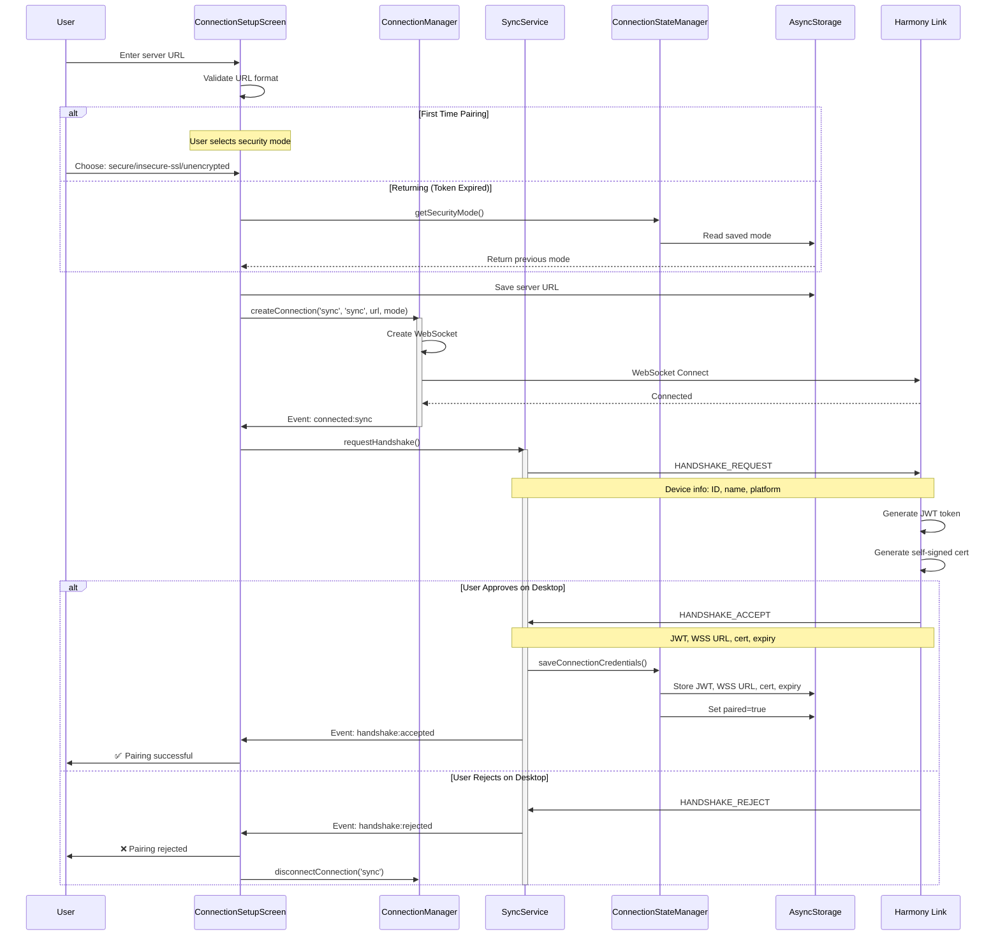
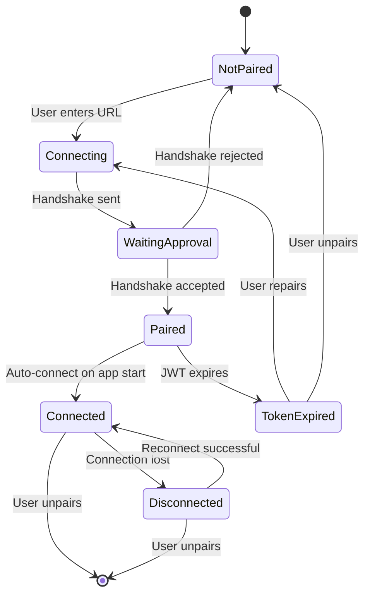
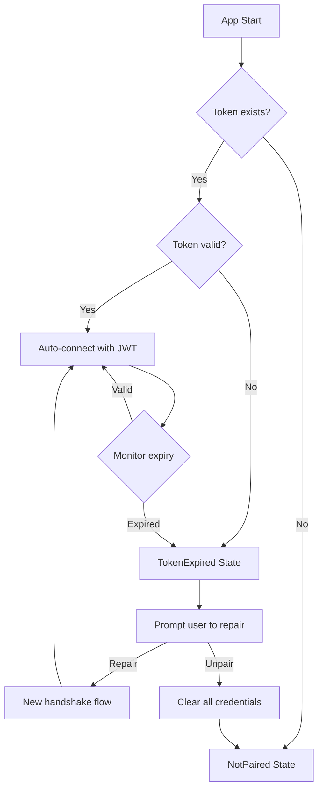
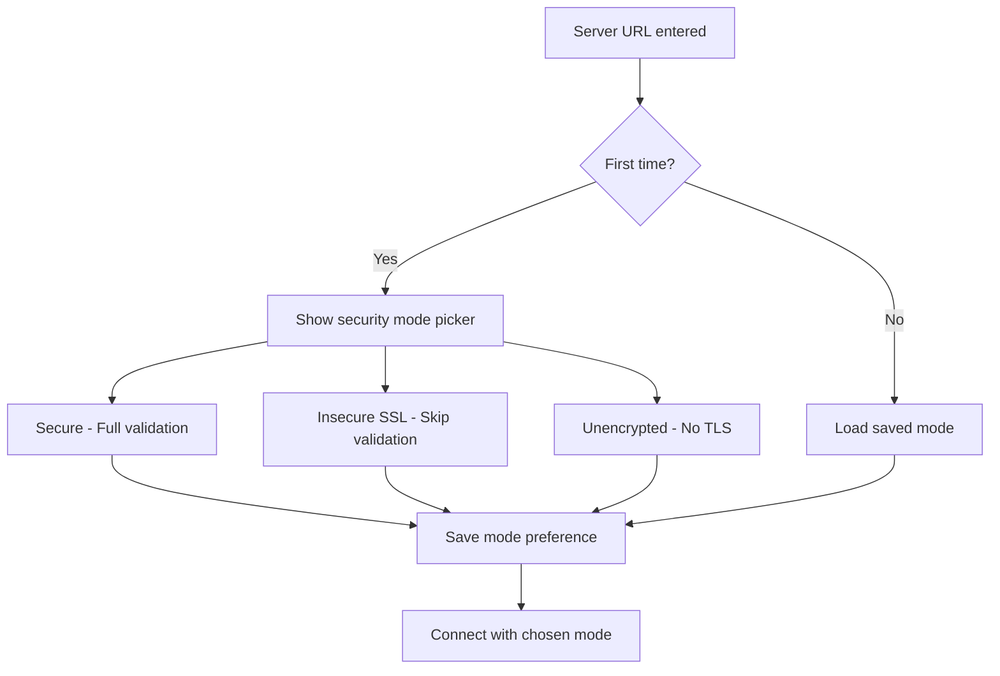
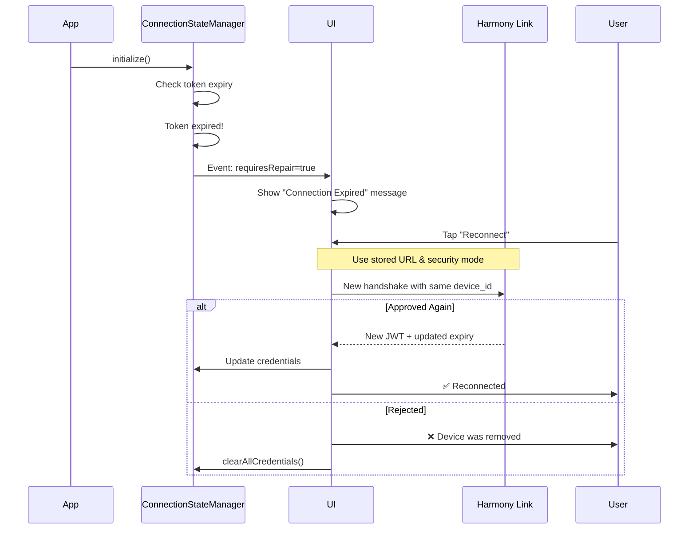

# Device Pairing Flow

This diagram shows the complete device pairing and handshake sequence between the mobile app and Harmony Link.

## Complete Pairing Sequence



## State Machine - Connection States



## Handshake Request Payload

```json
{
  "event_id": "sync_123456789_abc",
  "event_type": "HANDSHAKE_REQUEST",
  "status": "NEW",
  "payload": {
    "device_id": "unique-device-id",
    "device_name": "User's Phone",
    "device_type": "harmony_app",
    "device_platform": "android" // or "ios"
  }
}
```

## Handshake Accept Response

```json
{
  "event_id": "sync_123456789_abc",
  "event_type": "HANDSHAKE_ACCEPT",
  "status": "SUCCESS",
  "payload": {
    "jwt_token": "eyJhbGciOiJIUzI1...",
    "wss_port": 8081,
    "server_cert": "-----BEGIN CERTIFICATE-----\n...",
    "token_expires_at": 1738888888
  }
}
```

## Stored Credentials

After successful handshake, these values are stored in AsyncStorage:

| Key | Value | Purpose |
|-----|-------|---------|
| `harmony_jwt` | JWT token | Authentication for sync/entity connections |
| `harmony_ws_url` | `ws://server:8080/events` | Unencrypted connection URL |
| `harmony_wss_url` | `wss://server:8081/events` | Secure connection URL |
| `harmony_server_cert` | PEM certificate | Self-signed cert for validation |
| `harmony_token_expires_at` | Unix timestamp | Token expiry time |
| `harmony_paired` | `"true"` | Device paired flag |
| `harmony_security_mode` | `"secure"` etc. | User's security preference |

## Token Lifecycle



## Security Mode Selection Flow

First-time pairing allows user to choose security mode:



**Security Mode Implications:**

- **Secure**: Validates server certificate against system trust store + provided cert
- **Insecure SSL**: Accepts any certificate (for self-signed in dev)
- **Unencrypted**: Uses ws:// on port 8080 (no encryption)

## Re-pairing After Token Expiry

When JWT token expires, user must repair:



---

[← Previous: Connection Architecture](./01-connection-architecture.md) | [Back to Overview](../HARMONY-LINK-INTEGRATION.md) | [Next: Sync Protocol →](./03-sync-protocol.md)
