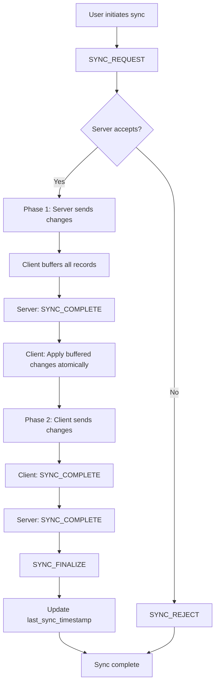
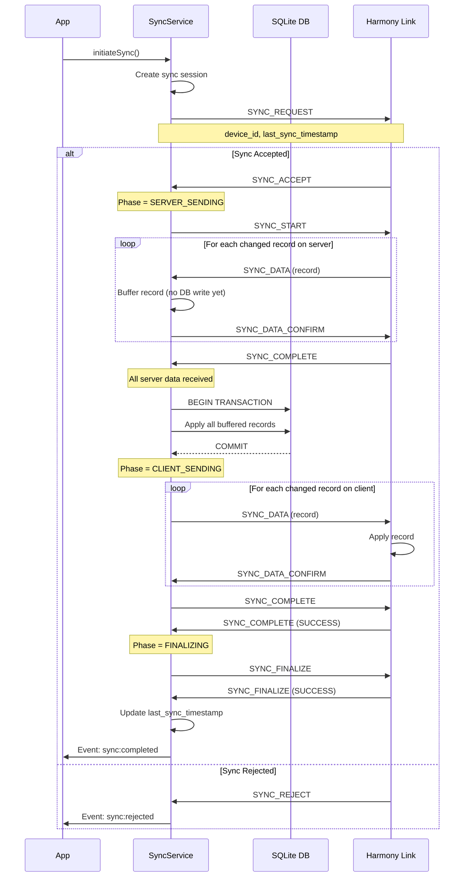
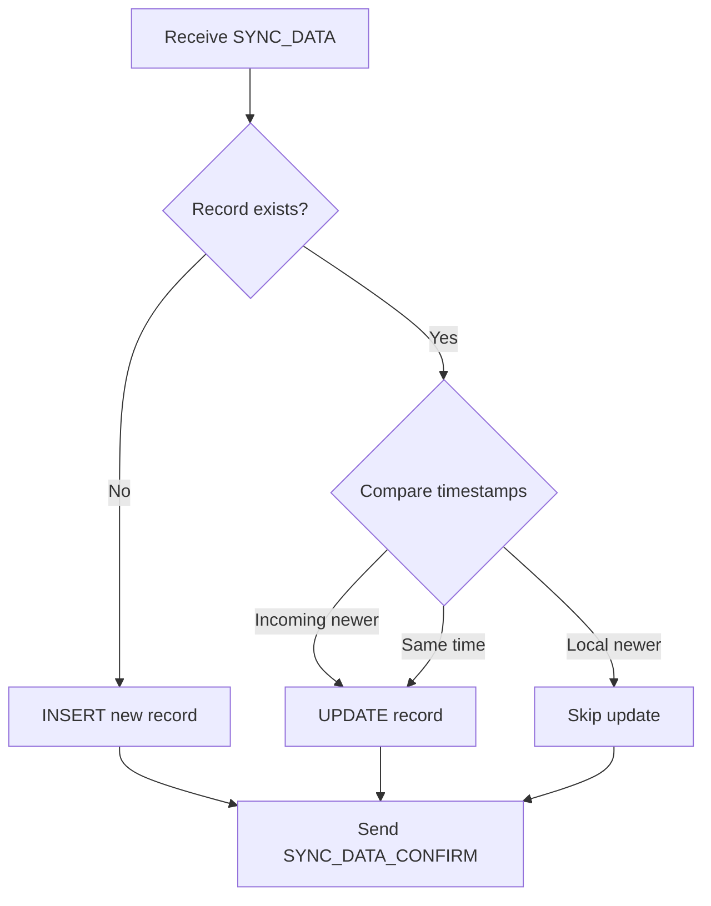
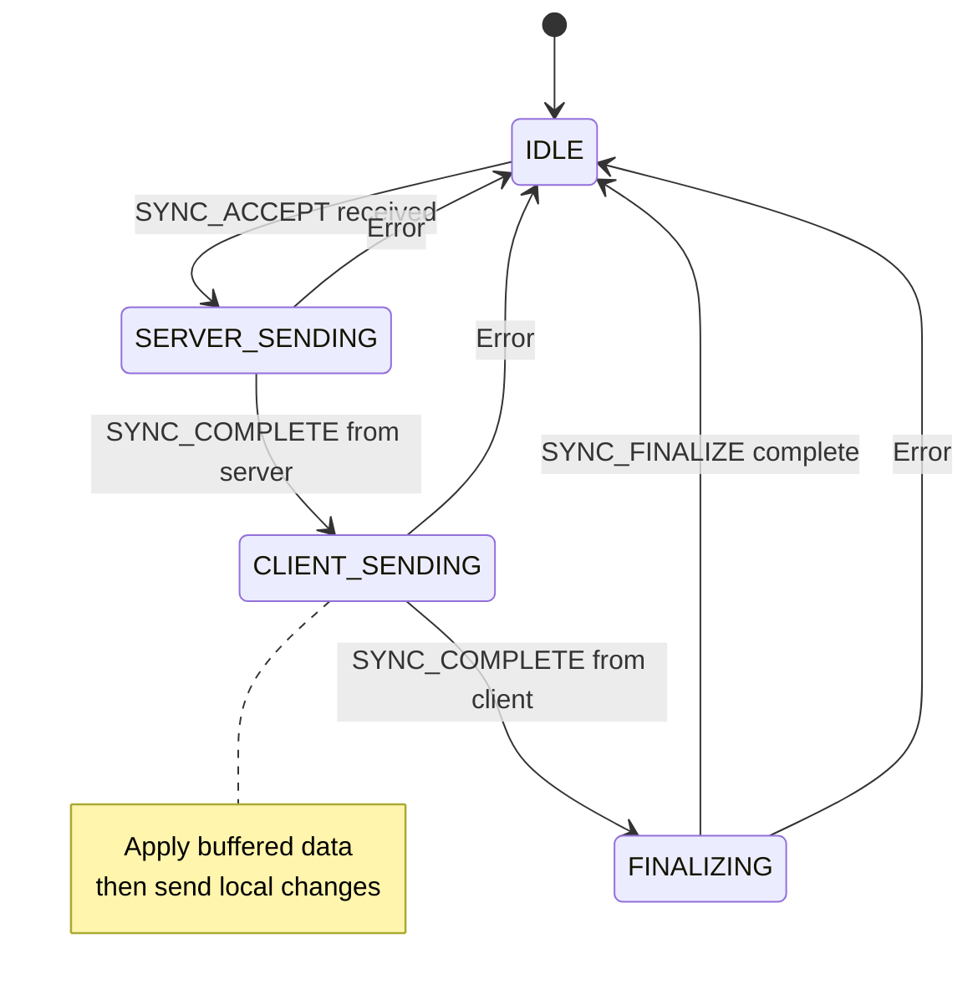
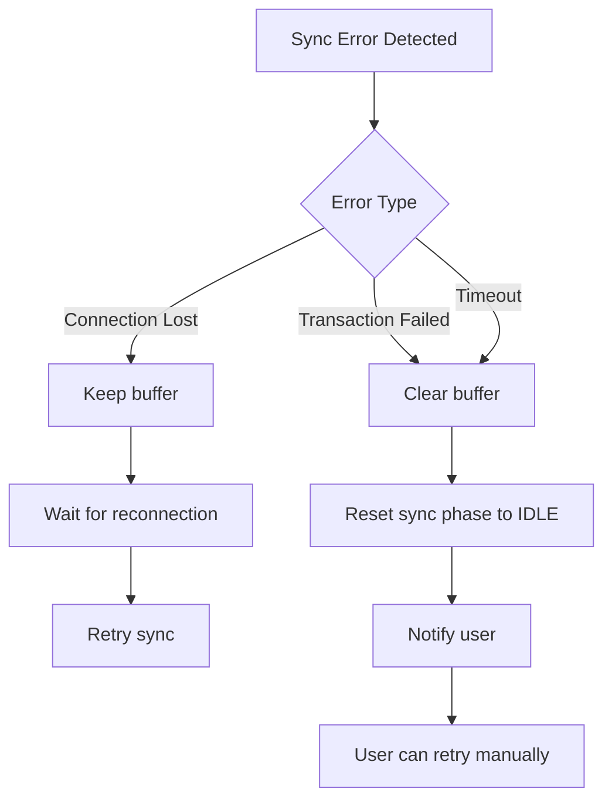

# Sync Protocol

This diagram shows the complete bidirectional data synchronization protocol between the mobile app and Harmony Link.

## Sync Protocol Overview

The sync protocol is a **sequential master-slave protocol** with per-record confirmation, ensuring data consistency across devices.



## Complete Sync Sequence



## SYNC_REQUEST Payload

```json
{
  "event_id": "sync_1234567890_xyz",
  "event_type": "SYNC_REQUEST",
  "status": "NEW",
  "payload": {
    "device_id": "unique-device-id",
    "device_name": "User's Phone",
    "device_type": "harmony_app",
    "device_platform": "android",
    "current_utc_timestamp": 1738900000,
    "last_sync_timestamp": 1738800000
  }
}
```

## SYNC_DATA Payload Example

```json
{
  "event_id": "data_1234567890_abc",
  "event_type": "SYNC_DATA",
  "status": "NEW",
  "payload": {
    "sync_session_id": "session_xyz",
    "event_id": "data_1234567890_abc",
    "table": "character_profiles",
    "operation": "insert",
    "record": {
      "id": "char_123",
      "name": "Alice",
      "description": "Friendly AI",
      "created_at": 1738850000,
      "updated_at": 1738850000,
      "deleted_at": null
    }
  }
}
```

## Sync Table Order (Foreign Key Dependencies)

Records are synced in this order to respect foreign key constraints:

1. `character_profiles`
2. `character_image`
3. Provider configs (`provider_config_*`)
4. Module configs (`*_configs`)
5. `entities`
6. `entity_module_mappings`
7. `conversation_messages`

## Conflict Resolution: Last-Write-Wins



**Timestamp Comparison:**
- Incoming `updated_at` >= Local `updated_at` → Apply change
- Local `updated_at` > Incoming `updated_at` → Keep local

## Atomic Transaction Pattern

All incoming server data is buffered and applied in a single transaction:

```typescript
// Pseudo-code
const buffer = [];

// Phase 1: Buffer all incoming data
onSyncData(data) {
  buffer.push(data);
  sendConfirmation(data.event_id);
}

// After SYNC_COMPLETE from server
onServerComplete() {
  db.transaction(() => {
    for (const item of buffer) {
      if (item.operation === 'delete') {
        db.execute('UPDATE table SET deleted_at=? WHERE id=?');
      } else {
        const exists = db.select('SELECT id FROM table WHERE id=?');
        if (!exists) {
          db.execute('INSERT INTO table ...');
        } else {
          // Last-write-wins
          if (incoming.updated_at >= local.updated_at) {
            db.execute('UPDATE table SET ...');
          }
        }
      }
    }
  });
  
  buffer = [];
}
```

**Benefits:**
- All-or-nothing: Either all changes apply or none
- No partial sync state in database
- Automatic rollback on error
- Consistent data view

## Soft Delete Handling

Deleted records use `deleted_at` timestamp (soft delete):

```json
{
  "table": "character_profiles",
  "operation": "delete",
  "record": {
    "id": "char_123",
    "deleted_at": 1738860000,
    "updated_at": 1738860000
  }
}
```

The receiving side updates: `UPDATE table SET deleted_at=?, updated_at=? WHERE id=?`

## Sync Phases State Machine



## Error Handling



**Error Scenarios:**
1. **Connection Lost During Sync**: Buffer preserved, auto-retry on reconnect
2. **Transaction Failure**: Buffer cleared, phase reset to IDLE
3. **Confirmation Timeout**: Buffer cleared after 30 seconds
4. **Foreign Key Violation**: Transaction rolls back, error reported

## Manual Sync Trigger

User can manually trigger sync from SyncSettingsScreen:

```typescript
// In UI
await SyncService.initiateSync();

// Service emits progress events
SyncService.on('sync:progress', (session) => {
  console.log(`Sent: ${session.recordsSent}, Received: ${session.recordsReceived}`);
});

SyncService.on('sync:completed', (session) => {
  console.log('Sync finished!');
});
```

## Automatic Sync Triggers

Sync is automatically initiated when:

1. **After message sent**: `EntitySessionService` triggers sync after storing message
2. **On reconnection**: After connection restored
3. **Manual**: User taps sync button

## Performance Considerations

- **Sequential with Confirmation**: Ensures reliability but slower than batch
- **Buffered Application**: Reduces database writes, faster than per-record
- **Payload Size Logging**: Helps identify large records affecting performance
- **Connection-specific**: Sync uses dedicated `sync` connection

---

[← Previous: Device Pairing](./02-device-pairing.md) | [Back to Overview](../HARMONY-LINK-INTEGRATION.md) | [Next: Entity Sessions →](./04-entity-sessions.md)
