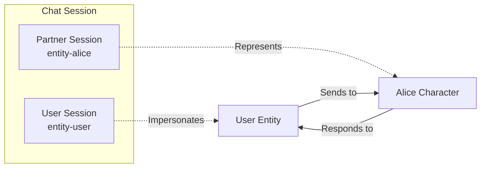
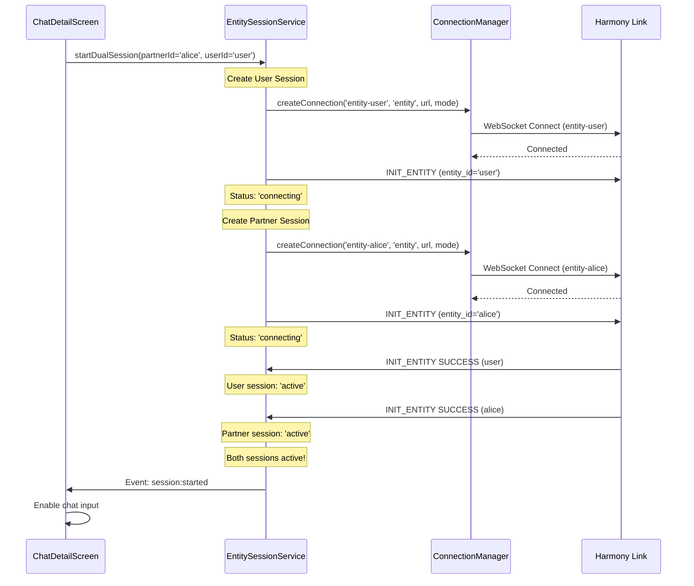
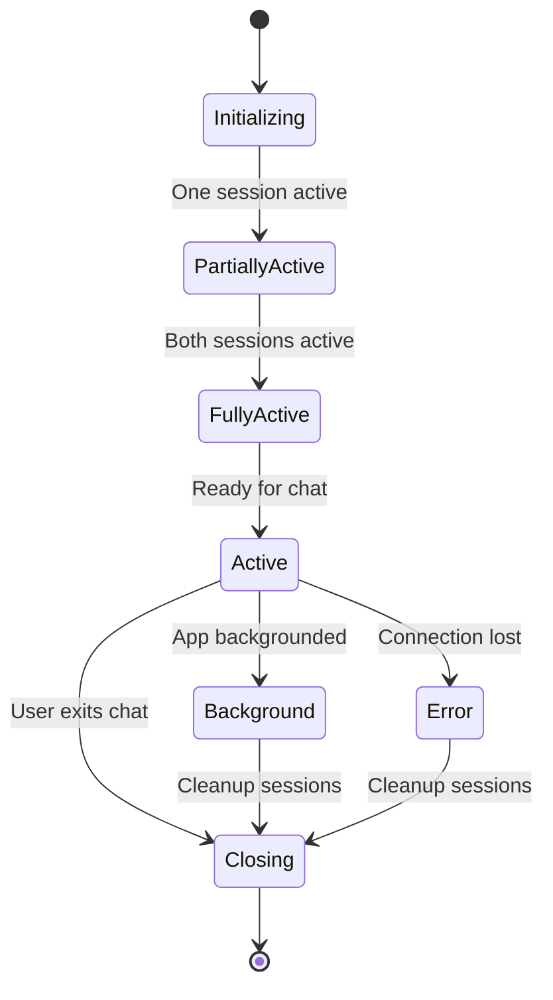
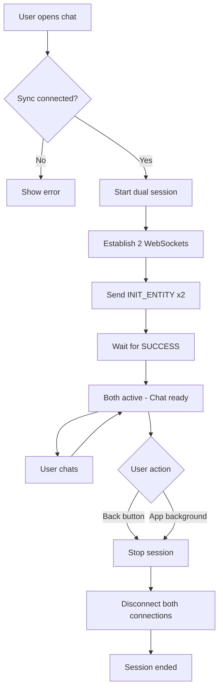
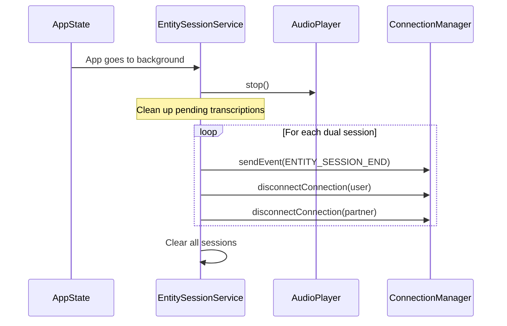
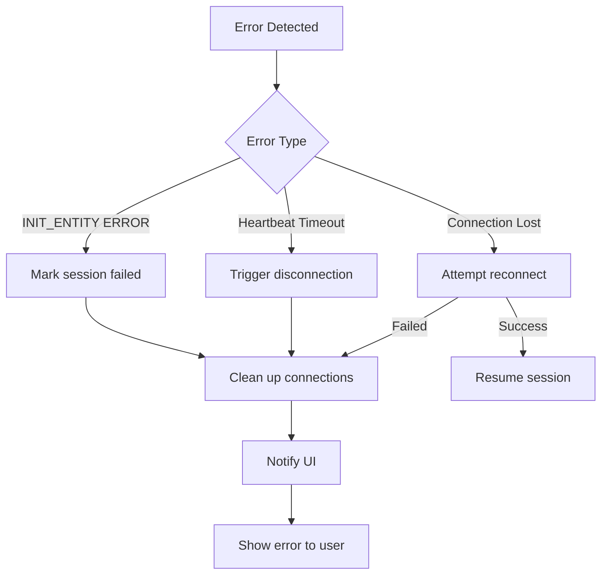

# Entity Sessions

This diagram shows how dual entity chat sessions are established and managed for real-time conversations with AI characters.

## Dual Entity Session Concept

Each chat requires **TWO separate entity sessions**:



**Why Dual Sessions?**
- Separate event streams for user and AI character
- Independent connection management
- Allows user to send messages AND receive transcriptions on their own connection
- AI responses arrive on partner connection

## Session Initialization Sequence



## INIT_ENTITY Request

```json
{
  "event_id": "evt_1234567890_abc",
  "event_type": "INIT_ENTITY",
  "status": "NEW",
  "payload": {
    "entity_id": "alice",
    "device_type": "harmony_app",
    "device_id": "unique-device-id",
    "device_platform": "android",
    "capabilities": ["chat", "voice", "images"],
    "tts_output_type": "binary"
  }
}
```

**Key Fields:**
- `tts_output_type: "binary"`: Request audio as base64 (not file path)
- `capabilities`: Informs server what features this device supports

## INIT_ENTITY Response

```json
{
  "event_id": "evt_1234567890_abc",
  "event_type": "INIT_ENTITY",
  "status": "SUCCESS",
  "payload": {
    "session_id": "session_xyz_789",
    "entity_id": "alice"
  }
}
```

The `session_id` is stored and used for subsequent operations.

## Dual Session State Machine



## Connection Lifecycle



## Entity Session Context

The `EntitySessionContext` provides session management to UI:

```typescript
interface EntitySessionContext {
  // Start a chat session
  startSession: (partnerId: string, userId?: string) => Promise<void>;
  
  // Stop a chat session
  stopSession: (partnerId: string) => Promise<void>;
  
  // Get session info
  getSessionInfo: (partnerId: string) => SessionInfo | null;
  
  // Check if session is active
  isSessionActive: (partnerId: string) => boolean;
}
```

## Session Cleanup

Sessions are automatically cleaned up when:

1. **User exits chat**: `stopSession()` called explicitly
2. **App backgrounded**: AppState listener triggers `closeAllSessions()`
3. **Connection lost**: Detected via heartbeat timeout
4. **Error occurs**: Session marked as failed and cleaned up



## Pending Sessions Tracking

During initialization, sessions are tracked separately:

```typescript
// Before both sessions are active
pendingSessions: Map<entityId, EntitySession>

// After both sessions active
sessions: Map<partnerId, DualEntitySession>
```

This allows handling INIT_ENTITY responses for each entity independently.

## Error Handling



**Common Errors:**
- `INIT_ENTITY` fails (entity not found, permissions, etc.)
- WebSocket connection drops during session
- Heartbeat timeout (no PONG response)
- Sync connection lost (entity sessions require sync)

## Multiple Chat Sessions

While theoretically possible, the app currently limits to **one active chat at a time**:

```typescript
// Only one dual session active
if (sessions.has(otherPartnerId)) {
  await stopSession(otherPartnerId);
}
await startDualSession(newPartnerId);
```

This simplifies:
- Resource management
- Audio playback (only one audio stream)
- UI state management

---

[← Previous: Sync Protocol](./03-sync-protocol.md) | [Back to Overview](../HARMONY-LINK-INTEGRATION.md) | [Next: Message Flows →](./05-message-flows.md)
