# Message Flows

This diagram shows the complete flow for text, voice, and image messages between the mobile app and AI characters.

## Text Message Flow

### Sending Text Message


### ENTITY_UTTERANCE Payload (Text)

```json
{
  "event_id": "evt_1234567890_xyz",
  "event_type": "ENTITY_UTTERANCE",
  "status": "NEW",
  "payload": {
    "message_id": "msg_01234567-89ab-7cde",
    "entity_id": "user",
    "content": "Hello, how are you?",
    "type": "UTTERANCE_COMBINED"
  }
}
```

## Voice Message Flow

### Recording and Sending Voice


### STT_INPUT_AUDIO Payload

```json
{
  "event_id": "evt_1234567890_abc",
  "event_type": "STT_INPUT_AUDIO",
  "status": "NEW",
  "payload": {
    "message_id": "msg_01234567-89ab-7cde",
    "audio_data": {
      "audio_bytes": "base64_encoded_wav_data...",
      "channels": 1,
      "bit_depth": 16,
      "sample_rate": 16000
    },
    "result_mode": "return"
  }
}
```

**Result Modes:**
- `"return"`: Sends STT_OUTPUT_TEXT back to client (used by app)
- `"process"`: Forwards transcript to Cognition module (used by plugins)

### STT_OUTPUT_TEXT Response

```json
{
  "event_id": "evt_1234567890_abc",
  "event_type": "STT_OUTPUT_TEXT",
  "status": "NEW",
  "payload": {
    "message_id": "msg_01234567-89ab-7cde",
    "content": "Hello, how are you?"
  }
}
```

## Receiving AI Voice Response

```mermaid
sequenceDiagram
    participant HL as Harmony Link
    participant ESS as EntitySessionService
    participant DB as SQLite DB
    participant AP as AudioPlayer
    participant UI as ChatDetailScreen
    participant User
    
    HL->>ESS: ENTITY_UTTERANCE
    Note over HL,ESS: audio + content + audio_type
    
    ESS->>DB: INSERT AI message
    Note over DB: Store base64 audio + transcript
    
    ESS->>UI: message:received event
    UI->>UI: Reload messages
    UI->>User: Show message with play button
    
    opt User plays audio
        User->>UI: Tap play button
        UI->>AP: playAudio(base64, mimeType, messageId)
        AP->>AP: Decode base64 to audio
        AP->>AP: Initialize TrackPlayer
        AP->>User: 🔊 Audio plays
        
        AP->>UI: Progress updates
        UI->>UI: Update playback progress bar
        
        AP->>UI: Playback complete
        UI->>UI: Reset play button
    end
```



## Image Message Flow (In Progress)

### Sending Image Message


**Note**: Image messages are currently in progress. The protocol supports them but full integration with vision models is pending.

## Chat Indicators

### Typing Indicator Flow


### Recording Indicator Flow

Similar to typing, but shows "Alice is recording a voice message..."

## Message Storage Schema

```sql
CREATE TABLE conversation_messages (
  id TEXT PRIMARY KEY,                  -- UUID v7
  entity_id TEXT NOT NULL,              -- Partner entity (from user's view)
  sender_entity_id TEXT NOT NULL,       -- Who sent it
  session_id TEXT NOT NULL,             -- Entity session ID
  content TEXT NOT NULL,                -- Message text
  audio_duration REAL,                  -- Voice message duration (seconds)
  message_type TEXT NOT NULL,           -- 'text', 'audio', 'combined', 'image'
  audio_data TEXT,                      -- Base64 encoded audio
  audio_mime_type TEXT,                 -- 'audio/wav', etc.
  image_data TEXT,                      -- Base64 encoded image
  image_mime_type TEXT,                 -- 'image/jpeg', etc.
  vl_model TEXT,                        -- Vision model used (if any)
  vl_model_interpretation TEXT,         -- Vision model analysis
  vl_model_embedding TEXT,              -- Vision embedding (JSON)
  created_at INTEGER NOT NULL,          -- Unix timestamp
  updated_at INTEGER NOT NULL,          -- Unix timestamp
  deleted_at INTEGER                    -- Soft delete timestamp
);
```

## Optimistic UI Pattern

The app uses optimistic updates for better UX:


**Benefits:**
- Instant feedback (no waiting for network)
- Messages appear immediately
- Network latency hidden from user
- Failures handled gracefully

## Message Lifecycle States


**Current Implementation:**
- The app stores messages locally first (optimistic)
- Network send happens asynchronously
- No explicit retry mechanism yet (manual resend only)
- Failed messages remain in DB for user reference

---

[← Previous: Entity Sessions](./04-entity-sessions.md) | [Back to Overview](../HARMONY-LINK-INTEGRATION.md)
